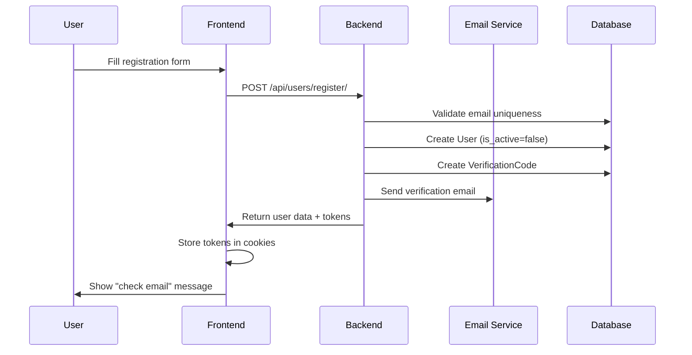
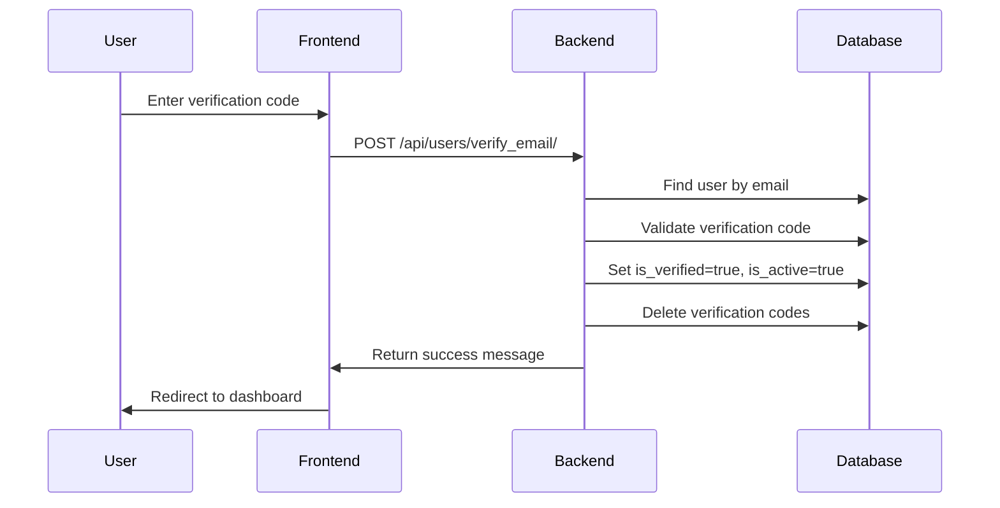
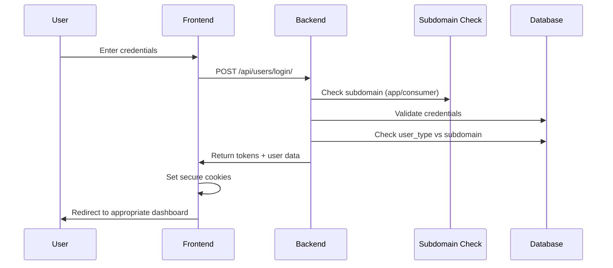
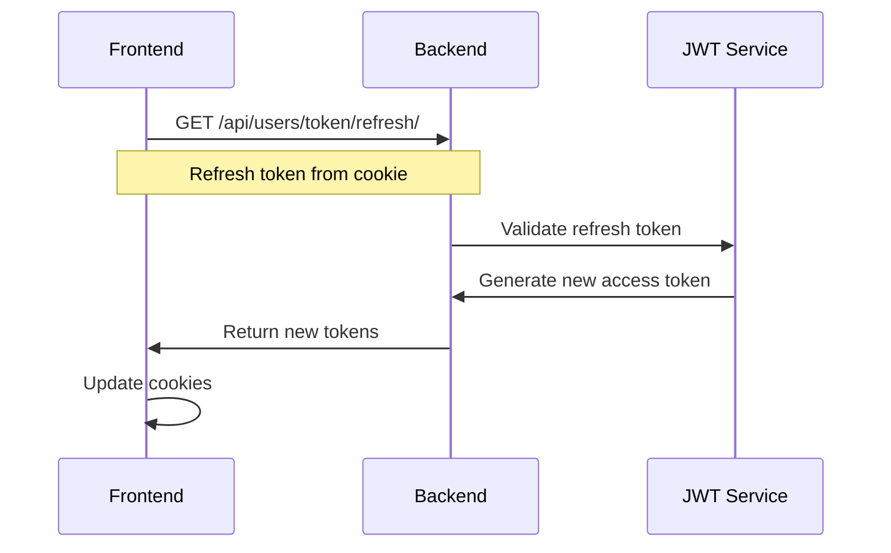
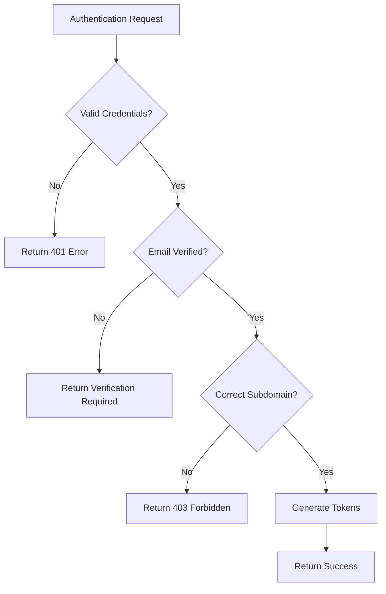

# User Authentication Flow

## Overview and Purpose

The User Authentication Flow manages secure user registration, login, email verification, and session management for the Trazo platform. It supports multi-tenant architecture with role-based access control and domain-specific access (app.trazo.io for producers, consumer.trazo.io for consumers).

## Technical Architecture

### Backend Components
- **users/views.py**: Authentication viewsets and API endpoints
- **users/models.py**: User, WorksIn, and VerificationCode models
- **users/serializers.py**: Data validation and transformation
- **JWT Tokens**: Access and refresh token management
- **Email Service**: Verification code delivery
- **Role Management**: Company-based role assignments

### Frontend Components
- **store/api/authApi.js**: RTK Query authentication API
- **store/features/authSlice.js**: Redux state management
- **views/Authentication/**: Sign-in and sign-up components
- **utils/protections/**: Route protection components

## Step-by-Step Process

### 1. User Registration Flow



#### Registration API Details
- **Endpoint**: `POST /api/users/register/`
- **Payload**:
```json
{
  "first_name": "John",
  "last_name": "Doe",
  "email": "john@example.com",
  "password": "SecurePassword123!",
  "user_type": 1,
  "phone": "+1234567890"
}
```

- **Response**:
```json
{
  "user": {
    "id": 123,
    "email": "john@example.com",
    "first_name": "John",
    "last_name": "Doe",
    "is_verified": false,
    "user_type": 1
  },
  "refresh": "eyJ0eXAiOiJKV1QiLCJhbGciOiJIUzI1NiJ9...",
  "token": "eyJ0eXAiOiJKV1QiLCJhbGciOiJIUzI1NiJ9..."
}
```

### 2. Email Verification Flow



#### Email Verification API Details
- **Endpoint**: `POST /api/users/verify_email/`
- **Payload**:
```json
{
  "email": "john@example.com",
  "code": "123456"
}
```

- **Response**:
```json
{
  "message": "Email verified successfully"
}
```

### 3. User Login Flow



#### Login API Details
- **Endpoint**: `POST /api/users/login/`
- **Payload**:
```json
{
  "email": "john@example.com",
  "password": "SecurePassword123!"
}
```

- **Response**:
```json
{
  "access": "eyJ0eXAiOiJKV1QiLCJhbGciOiJIUzI1NiJ9...",
  "refresh": "eyJ0eXAiOiJKV1QiLCJhbGciOiJIUzI1NiJ9...",
  "user": {
    "id": 123,
    "email": "john@example.com",
    "user_type": 1,
    "companies": [
      {
        "id": 1,
        "name": "Farm Co",
        "role": "CA"
      }
    ]
  }
}
```

### 4. Token Refresh Flow



## Database Models

### User Model
```python
class User(AbstractUser):
    username = None  # Email-based authentication
    email = EmailField(unique=True, db_index=True)
    is_active = BooleanField(default=False)
    is_verified = BooleanField(default=False)
    phone = CharField(max_length=255, blank=True)
    user_type = PositiveSmallIntegerField(choices=USER_TYPE_CHOICES)
    companies = ManyToManyField(Company, through="WorksIn")
    image = ImageField(upload_to="user_images/", blank=True)
    
    USERNAME_FIELD = "email"
```

### WorksIn Model (Role Management)
```python
class WorksIn(models.Model):
    USER_ROLES = [
        ("CA", "Company Admin"),
        ("DS", "Domain Supervisor"), 
        ("DW", "Domain Worker"),
        ("DE", "Dealer"),
    ]
    
    user = ForeignKey(User, on_delete=CASCADE)
    company = ForeignKey(Company, on_delete=CASCADE)
    role = CharField(choices=USER_ROLES, max_length=5)
    establishments_in_charge = ManyToManyField(Establishment)
    role_group = ForeignKey(Group, on_delete=CASCADE)
```

### VerificationCode Model
```python
class VerificationCode(models.Model):
    user = ForeignKey(User, on_delete=CASCADE)
    code = CharField(max_length=255)
    created_at = DateTimeField(auto_now_add=True)
    
    class Meta:
        unique_together = ("user", "code")
```

## External Integrations

### JWT Token Configuration
```python
SIMPLE_JWT = {
    'ACCESS_TOKEN_LIFETIME': timedelta(minutes=60),
    'REFRESH_TOKEN_LIFETIME': timedelta(days=7),
    'ROTATE_REFRESH_TOKENS': True,
    'AUTH_COOKIE_SECURE': True,
    'AUTH_COOKIE_HTTP_ONLY': True,
    'AUTH_COOKIE_SAMESITE': 'None',
}
```

### Email Service Integration
- **SMTP Configuration**: Production-ready email delivery
- **Template System**: HTML email templates
- **Verification Codes**: 6-digit random codes with 24-hour expiry

## Caching Strategy

### Redis Caching
- **User Sessions**: Cache active user sessions for faster lookup
- **Permission Cache**: Cache user permissions and roles
- **Rate Limiting**: Use Redis for authentication attempt tracking

```python
# Example caching implementation
cache_key = f"user_permissions_{user.id}"
permissions = cache.get(cache_key)
if not permissions:
    permissions = get_user_permissions(user)
    cache.set(cache_key, permissions, 3600)  # 1 hour
```

## Error Handling

### Common Error Scenarios

1. **Invalid Credentials**
   - Status: 401 Unauthorized
   - Response: `{"error": "Invalid email or password"}`

2. **Email Already Exists**
   - Status: 400 Bad Request
   - Response: `{"email": ["User with this email already exists"]}`

3. **Invalid Verification Code**
   - Status: 400 Bad Request
   - Response: `{"error": "Verification code is invalid"}`

4. **Subdomain Access Denied**
   - Status: 403 Forbidden
   - Response: `{"error": "Access denied"}`

5. **Token Expired**
   - Status: 401 Unauthorized
   - Response: `{"error": "Token is invalid or expired"}`

### Error Handling Flow


## Security Considerations

### Authentication Security
1. **Password Requirements**: Minimum 8 characters, mixed case, numbers
2. **Email Verification**: Required before account activation
3. **Subdomain Validation**: Prevent cross-domain access
4. **Rate Limiting**: 5 login attempts per minute per IP
5. **Secure Cookies**: HttpOnly, Secure, SameSite attributes

### Token Security
1. **JWT Signing**: HS256 algorithm with secret key rotation
2. **Token Expiry**: Short-lived access tokens (1 hour)
3. **Refresh Rotation**: New refresh token on each refresh
4. **Domain Restriction**: Tokens tied to specific subdomains

### Session Management
```python
cookie_options = {
    'secure': settings.SIMPLE_JWT['AUTH_COOKIE_SECURE'],
    'httponly': settings.SIMPLE_JWT['AUTH_COOKIE_HTTP_ONLY'],
    'samesite': settings.SIMPLE_JWT['AUTH_COOKIE_SAMESITE'],
    'domain': settings.CSRF_COOKIE_DOMAIN
}
```

## Performance Metrics

### Expected Response Times
- **Login**: <300ms for cached user data
- **Registration**: <500ms including email sending
- **Token Refresh**: <100ms
- **Email Verification**: <200ms

### Scalability Considerations
- **Database Indexing**: Email field indexed for fast lookup
- **Connection Pooling**: Database connection optimization
- **CDN Integration**: Static asset delivery optimization

## Frontend Integration

### RTK Query API Configuration
```typescript
export const authApi = createApi({
  reducerPath: 'authApi',
  baseQuery: customFetchBase,
  tagTypes: ['User'],
  endpoints: (builder) => ({
    login: builder.mutation({
      query: (credentials) => ({
        url: '/users/login/',
        method: 'POST',
        body: credentials,
      }),
    }),
    register: builder.mutation({
      query: (userData) => ({
        url: '/users/register/',
        method: 'POST', 
        body: userData,
      }),
    }),
    verifyEmail: builder.mutation({
      query: ({ email, code }) => ({
        url: '/users/verify_email/',
        method: 'POST',
        body: { email, code },
      }),
    }),
  }),
});
```

### Route Protection
```typescript
function Authenticated({ children }) {
  const { isAuthenticated, isLoading } = useAuth();
  
  if (isLoading) return <LoadingSpinner />;
  if (!isAuthenticated) return <Navigate to="/auth/signin" />;
  
  return children;
}
```

## Testing Scenarios

### Unit Tests
1. **User Registration**: Valid/invalid data validation
2. **Email Verification**: Code generation and validation
3. **Login**: Credential validation and token generation
4. **Subdomain Check**: Cross-domain access prevention

### Integration Tests
1. **End-to-End Registration**: Full registration and verification flow
2. **Login Flow**: Complete authentication with redirect
3. **Token Refresh**: Automatic token renewal
4. **Role-Based Access**: Permission validation

### Security Tests
1. **Brute Force Protection**: Rate limiting effectiveness
2. **Token Manipulation**: JWT signature validation
3. **Cross-Site Attacks**: CSRF and XSS prevention
4. **Session Fixation**: Session security validation

---

*Last Updated: 2025-06-27*
*Flow Version: 1.0*