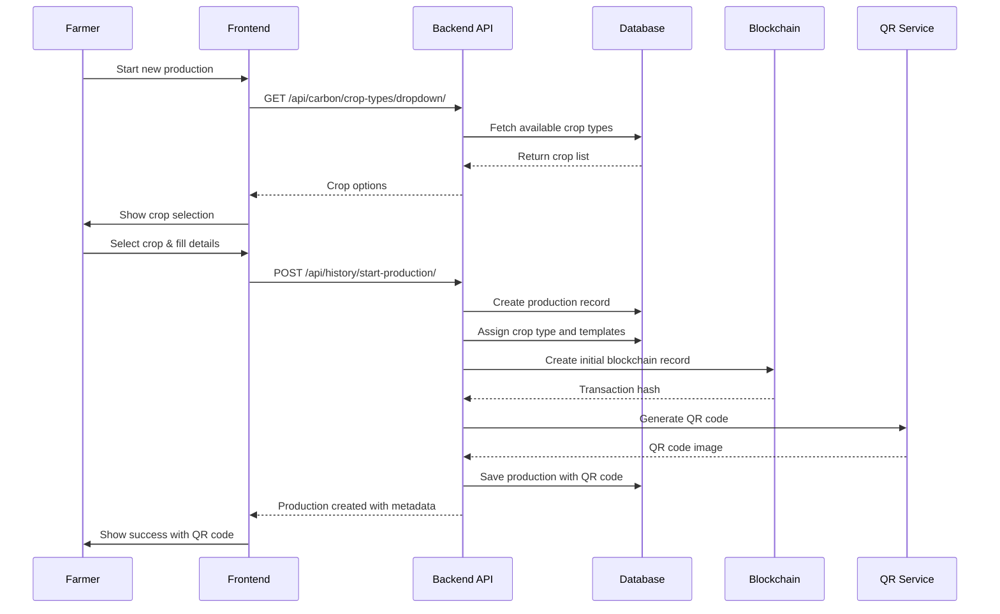
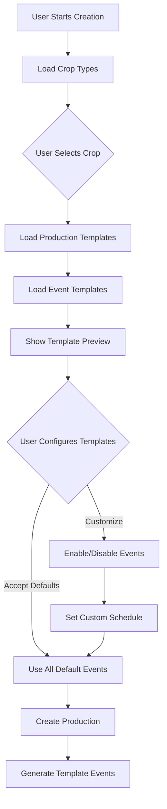
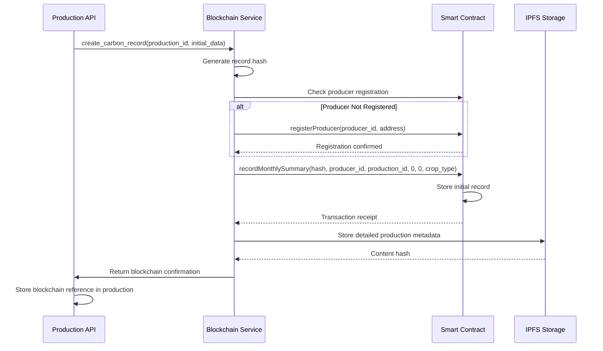
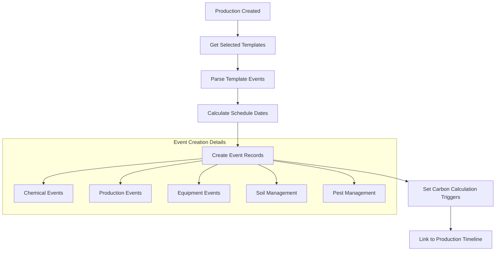
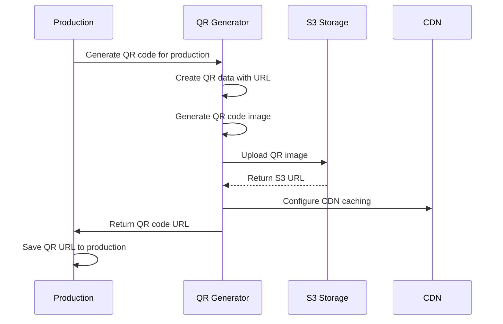
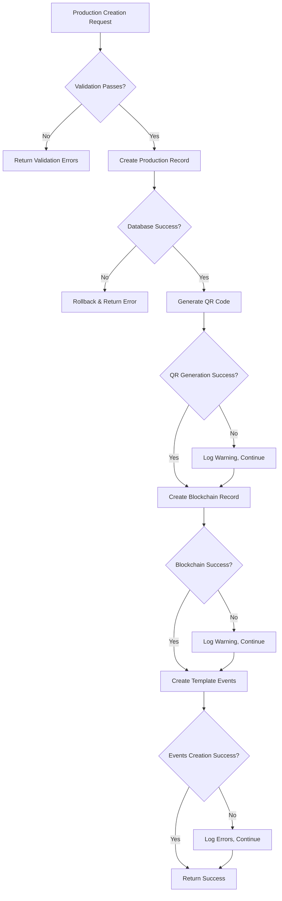

# Production Creation Flow

## Overview and Purpose

The Production Creation Flow enables farmers to start new agricultural productions with comprehensive crop selection, template-based event planning, and automatic carbon footprint tracking. This flow integrates blockchain verification, USDA compliance, and automated QR code generation for consumer transparency.

## Technical Architecture

### Backend Components
- **history/views.py**: Production management APIs
- **carbon/models.py**: Crop types and production templates
- **carbon/services/blockchain.py**: Blockchain integration
- **product/models.py**: Parcel and product management
- **history/models.py**: Production and event models

### Frontend Components
- **views/Dashboard/Production/**: Production management interface
- **components/Setup/SmartSetupWizard.tsx**: Guided production creation
- **components/Forms/StandardProductionForm.tsx**: Standardized forms
- **store/api/historyApi.ts**: Production API integration

### Key Features
- **Crop Selection**: Database-driven crop types with USDA factors
- **Template System**: Pre-configured event templates per crop
- **Blockchain Integration**: Immutable production records
- **QR Code Generation**: Automatic transparency codes
- **USDA Compliance**: Built-in agricultural standards

## Step-by-Step Process

### 1. Production Creation Wizard



#### Production Creation API
- **Endpoint**: `POST /api/history/start-production/`
- **Payload**:
```json
{
  "name": "Summer Citrus 2025",
  "parcel_id": 5,
  "crop_type": 2,
  "start_date": "2025-06-27T08:00:00Z",
  "expected_harvest": "2025-12-15T08:00:00Z",
  "production_method": "organic",
  "estimated_yield": "2500 kg",
  "irrigation_method": "drip",
  "age_of_plants": "5 years",
  "number_of_plants": "150",
  "soil_ph": "6.5",
  "is_outdoor": true,
  "notes": "First organic certification attempt",
  "template_events": [
    {
      "template_id": 15,
      "enabled": true,
      "scheduled_date": "2025-07-15T06:00:00Z"
    }
  ]
}
```

- **Response**:
```json
{
  "id": 123,
  "name": "Summer Citrus 2025",
  "start_date": "2025-06-27T08:00:00Z",
  "finish_date": "2025-12-15T08:00:00Z",
  "crop_type": {
    "id": 2,
    "name": "Citrus (Oranges)",
    "category": "tree_fruit",
    "emissions_per_hectare": 1200.5
  },
  "parcel": {
    "id": 5,
    "name": "North Field",
    "area": 2.5
  },
  "qr_code_url": "/media/qr_codes/Citrus_2025-2025-06-27_123456789.png",
  "blockchain_transaction": "0x742d35cc6527c7b8e2c6e3b6c7e8d9f0a1b2c3d4",
  "blockchain_verified": true,
  "establishment": {
    "id": 3,
    "name": "Green Valley Farm",
    "location": "Fresno, CA"
  },
  "extra_data": {
    "crop_category": "fruits",
    "production_method": "organic",
    "blockchain_enabled": true,
    "created_via": "production_start_form"
  }
}
```

### 2. Crop Selection and Template Loading



#### Crop Type Database Structure
```python
class CropType(models.Model):
    name = CharField(max_length=100, unique=True)  # e.g., "Citrus (Oranges)"
    slug = SlugField(max_length=100, unique=True)  # e.g., "citrus_oranges"
    category = CharField(max_length=20, choices=CATEGORY_CHOICES)
    description = TextField()
    
    # Agricultural characteristics
    typical_farm_size = CharField(max_length=100)  # "20-100 hectares"
    growing_season = CharField(max_length=100)     # "12 months (evergreen)"
    harvest_season = CharField(max_length=100)     # "November - April"
    
    # USDA benchmarks and carbon data
    emissions_per_hectare = FloatField()           # kg CO2e per hectare
    industry_average = FloatField()                # Industry average emissions
    best_practice = FloatField()                   # Best practice emissions
    carbon_credit_potential = FloatField()         # Potential credits per hectare
    
    # Economic data
    typical_cost_per_hectare = FloatField()
    fertilizer_cost_per_hectare = FloatField()
    fuel_cost_per_hectare = FloatField()
    
    # Premium pricing potential
    organic_premium = CharField(max_length=20, default='0%')
    sustainable_premium = CharField(max_length=20, default='0%')
    
    usda_verified = BooleanField(default=False)
    is_active = BooleanField(default=True)

class ProductionTemplate(models.Model):
    crop_type = ForeignKey(CropType, on_delete=CASCADE)
    name = CharField(max_length=100)               # "Citrus Organic Production"
    farming_approach = CharField(max_length=20, choices=FARMING_APPROACH_CHOICES)
    description = TextField()
    complexity_level = CharField(max_length=15, default='intermediate')
    estimated_setup_time = IntegerField(default=8)  # minutes
    
    # Carbon and economic projections
    projected_emissions_reduction = FloatField(default=0.0)  # % vs conventional
    projected_cost_change = FloatField(default=0.0)          # % cost change
    projected_yield_impact = FloatField(default=0.0)         # % yield change
    
    is_recommended = BooleanField(default=False)
    usage_count = IntegerField(default=0)
    usda_reviewed = BooleanField(default=False)
```

### 3. Blockchain Integration During Creation



#### Initial Blockchain Record Creation
```python
def _create_initial_blockchain_record(self, history, crop_type):
    """Create initial blockchain record for new production"""
    try:
        from carbon.services.blockchain import blockchain_service
        
        initial_carbon_data = {
            'production_id': history.id,
            'total_emissions': 0.0,
            'total_offsets': 0.0,
            'crop_type': crop_type.name,
            'calculation_method': 'initial_production_setup',
            'usda_verified': False,
            'timestamp': int(history.start_date.timestamp()),
            'carbon_score': 50,  # Initial neutral score
            'industry_percentile': 50,
            'producer_id': history.parcel.establishment.id,
            'farm_location': history.parcel.establishment.get_location(),
            'parcel_area': history.parcel.area if history.parcel else 0
        }
        
        blockchain_result = blockchain_service.create_carbon_record(
            history.id, 
            initial_carbon_data
        )
        
        # Store blockchain reference in production metadata
        if blockchain_result.get('blockchain_verified'):
            history.extra_data['blockchain_transaction'] = blockchain_result.get('transaction_hash')
            history.extra_data['blockchain_verified'] = True
            history.extra_data['blockchain_record_hash'] = blockchain_result.get('record_hash')
            history.save()
            
            logger.info(f"Blockchain record created for production {history.id}: {blockchain_result.get('transaction_hash')}")
        
        return blockchain_result
        
    except Exception as e:
        logger.error(f"Failed to create blockchain record for production {history.id}: {e}")
        # Don't fail production creation if blockchain fails
        return {
            'blockchain_verified': False,
            'error': str(e)
        }
```

### 4. Template Event Creation



#### Template Event Implementation
```python
def _create_template_events(self, history, template_events):
    """Create events from selected templates with scheduling"""
    from datetime import datetime, timedelta
    from django.utils import timezone
    
    current_event_count = 0
    created_events = []
    
    for event_data in template_events:
        if not event_data.get('enabled', True):
            continue
            
        try:
            # Get template from database
            template_id = event_data.get('template_id')
            event_template = EventTemplate.objects.get(id=template_id)
            
            # Parse scheduled date
            scheduled_date_str = event_data.get('scheduled_date')
            if scheduled_date_str:
                scheduled_date = datetime.fromisoformat(scheduled_date_str.replace('Z', '+00:00'))
                if scheduled_date.tzinfo is None:
                    scheduled_date = timezone.make_aware(scheduled_date)
            else:
                # Use template timing to calculate date
                scheduled_date = self._calculate_event_date(history.start_date, event_template.timing)
            
            current_event_count += 1
            
            # Create appropriate event type based on template
            event = self._create_event_from_template(
                event_template, 
                history, 
                scheduled_date, 
                current_event_count
            )
            
            if event:
                created_events.append(event)
                logger.info(f"Created event {event_template.name} for production {history.id}")
            
        except EventTemplate.DoesNotExist:
            logger.warning(f"Template {template_id} not found")
        except Exception as e:
            logger.error(f"Failed to create event from template {template_id}: {e}")
    
    return created_events

def _create_event_from_template(self, template, history, scheduled_date, index):
    """Create specific event type based on template configuration"""
    
    base_data = {
        'history': history,
        'description': f"{template.name}: {template.efficiency_tips}",
        'date': scheduled_date,
        'index': index,
        'created_by': history.operator
    }
    
    # Map template backend event type to model
    event_type_mapping = {
        0: None,  # Weather events not created from templates
        1: self._create_chemical_event,
        2: self._create_production_event,
        3: self._create_general_event,
        4: self._create_equipment_event,
        5: self._create_soil_management_event,
        6: self._create_pest_management_event
    }
    
    create_function = event_type_mapping.get(template.backend_event_type)
    if create_function:
        return create_function(template, base_data)
    
    return None

def _create_chemical_event(self, template, base_data):
    """Create chemical event from template"""
    from history.models import ChemicalEvent
    
    # Extract chemical-specific data from template
    typical_amounts = template.typical_amounts
    
    return ChemicalEvent.objects.create(
        **base_data,
        type=ChemicalEvent.FERTILIZER,  # Default type
        commercial_name=typical_amounts.get('commercial_name', 'Template Fertilizer'),
        volume=typical_amounts.get('volume', '100 liters'),
        concentration=typical_amounts.get('concentration', '10-10-10'),
        area='1 hectare',
        way_of_application=typical_amounts.get('application_method', 'broadcast'),
        extra_data={
            'template_id': template.id,
            'carbon_impact': template.carbon_impact,
            'efficiency_tips': template.efficiency_tips
        }
    )
```

### 5. QR Code Generation and Linking



#### QR Code Generation Implementation
```python
def generate_production_qr_code(self, history):
    """Generate QR code for production transparency"""
    import qrcode
    from io import BytesIO
    from django.core.files.base import ContentFile
    
    # Create consumer-facing URL
    consumer_url = f"{settings.BASE_CONSUMER_URL}production/{history.id}"
    
    # Generate QR code
    qr = qrcode.QRCode(
        version=1,
        error_correction=qrcode.constants.ERROR_CORRECT_M,  # Medium error correction
        box_size=10,
        border=4,
    )
    qr.add_data(consumer_url)
    qr.make(fit=True)
    
    # Create image
    qr_image = qr.make_image(fill_color="black", back_color="white")
    
    # Save to buffer
    buffer = BytesIO()
    qr_image.save(buffer, format='PNG')
    buffer.seek(0)
    
    # Generate filename
    crop_name = history.crop_type.name.replace(' ', '_') if history.crop_type else 'Production'
    start_date = history.start_date.strftime('%Y-%m-%d_%H%M%S%f')
    filename = f"{crop_name}_{start_date}.png"
    
    # Save to model
    history.qr_code.save(
        filename,
        ContentFile(buffer.getvalue()),
        save=False
    )
    
    return history.qr_code.url
```

## Frontend Implementation

### Smart Setup Wizard Component
```typescript
export const SmartSetupWizard: React.FC = () => {
  const [currentStep, setCurrentStep] = useState(1);
  const [formData, setFormData] = useState<ProductionFormData>({});
  const [selectedCrop, setSelectedCrop] = useState<CropType | null>(null);
  const [selectedTemplates, setSelectedTemplates] = useState<EventTemplate[]>([]);
  
  const { data: cropTypes } = useGetCropTypesDropdownQuery();
  const { data: templates } = useGetProductionTemplatesQuery(selectedCrop?.id, {
    skip: !selectedCrop
  });
  const [createProduction, { isLoading }] = useStartProductionMutation();
  
  const steps = [
    { id: 1, title: 'Basic Information', component: BasicInfoStep },
    { id: 2, title: 'Crop Selection', component: CropSelectionStep },
    { id: 3, title: 'Production Method', component: ProductionMethodStep },
    { id: 4, title: 'Event Templates', component: EventTemplatesStep },
    { id: 5, title: 'Review & Create', component: ReviewStep }
  ];
  
  const handleSubmit = async () => {
    try {
      const productionData = {
        ...formData,
        crop_type: selectedCrop?.id,
        template_events: selectedTemplates.map(template => ({
          template_id: template.id,
          enabled: true,
          scheduled_date: calculateScheduledDate(template, formData.start_date)
        }))
      };
      
      const result = await createProduction(productionData);
      
      if (result.data) {
        toast.success('Production created successfully!');
        navigate(`/admin/dashboard/production/${result.data.id}`);
      }
    } catch (error) {
      toast.error('Failed to create production');
    }
  };
  
  return (
    <Box maxW="800px" mx="auto" p={6}>
      <Progress value={(currentStep / steps.length) * 100} mb={6} />
      
      <VStack spacing={6}>
        <Text fontSize="2xl" fontWeight="bold">
          {steps[currentStep - 1].title}
        </Text>
        
        {currentStep === 1 && (
          <BasicInfoStep 
            data={formData}
            onChange={setFormData}
            onNext={() => setCurrentStep(2)}
          />
        )}
        
        {currentStep === 2 && (
          <CropSelectionStep
            cropTypes={cropTypes || []}
            selected={selectedCrop}
            onSelect={setSelectedCrop}
            onNext={() => setCurrentStep(3)}
            onBack={() => setCurrentStep(1)}
          />
        )}
        
        {currentStep === 3 && selectedCrop && (
          <ProductionMethodStep
            cropType={selectedCrop}
            data={formData}
            onChange={setFormData}
            onNext={() => setCurrentStep(4)}
            onBack={() => setCurrentStep(2)}
          />
        )}
        
        {currentStep === 4 && (
          <EventTemplatesStep
            templates={templates || []}
            selected={selectedTemplates}
            onSelect={setSelectedTemplates}
            onNext={() => setCurrentStep(5)}
            onBack={() => setCurrentStep(3)}
          />
        )}
        
        {currentStep === 5 && (
          <ReviewStep
            formData={formData}
            selectedCrop={selectedCrop}
            selectedTemplates={selectedTemplates}
            onSubmit={handleSubmit}
            onBack={() => setCurrentStep(4)}
            isLoading={isLoading}
          />
        )}
      </VStack>
    </Box>
  );
};
```

### Crop Selection Component
```typescript
const CropSelectionStep: React.FC<CropSelectionStepProps> = ({
  cropTypes,
  selected,
  onSelect,
  onNext,
  onBack
}) => {
  const [searchTerm, setSearchTerm] = useState('');
  const [selectedCategory, setSelectedCategory] = useState<string>('all');
  
  const filteredCrops = useMemo(() => {
    return cropTypes.filter(crop => {
      const matchesSearch = crop.name.toLowerCase().includes(searchTerm.toLowerCase());
      const matchesCategory = selectedCategory === 'all' || crop.category === selectedCategory;
      return matchesSearch && matchesCategory;
    });
  }, [cropTypes, searchTerm, selectedCategory]);
  
  const categories = useMemo(() => {
    const cats = Array.from(new Set(cropTypes.map(crop => crop.category)));
    return [{ value: 'all', label: 'All Categories' }].concat(
      cats.map(cat => ({ value: cat, label: cat.replace('_', ' ').replace(/\b\w/g, l => l.toUpperCase()) }))
    );
  }, [cropTypes]);
  
  return (
    <VStack spacing={6} w="full">
      <VStack spacing={4} w="full">
        <Input
          placeholder="Search crops..."
          value={searchTerm}
          onChange={(e) => setSearchTerm(e.target.value)}
          leftElement={<SearchIcon />}
        />
        
        <Select
          value={selectedCategory}
          onChange={(e) => setSelectedCategory(e.target.value)}
        >
          {categories.map(category => (
            <option key={category.value} value={category.value}>
              {category.label}
            </option>
          ))}
        </Select>
      </VStack>
      
      <SimpleGrid columns={{ base: 1, md: 2, lg: 3 }} spacing={4} w="full">
        {filteredCrops.map(crop => (
          <CropCard
            key={crop.id}
            crop={crop}
            isSelected={selected?.id === crop.id}
            onClick={() => onSelect(crop)}
          />
        ))}
      </SimpleGrid>
      
      <HStack spacing={4}>
        <Button variant="outline" onClick={onBack}>
          Back
        </Button>
        <Button 
          colorScheme="blue" 
          onClick={onNext}
          isDisabled={!selected}
        >
          Next
        </Button>
      </HStack>
    </VStack>
  );
};

const CropCard: React.FC<CropCardProps> = ({ crop, isSelected, onClick }) => (
  <Box
    border="2px solid"
    borderColor={isSelected ? 'blue.500' : 'gray.200'}
    borderRadius="lg"
    p={4}
    cursor="pointer"
    bg={isSelected ? 'blue.50' : 'white'}
    _hover={{ borderColor: 'blue.300', shadow: 'md' }}
    onClick={onClick}
  >
    <VStack spacing={3} align="start">
      <Text fontWeight="bold" fontSize="lg">
        {crop.name}
      </Text>
      <Text color="gray.600" fontSize="sm">
        {crop.description}
      </Text>
      <HStack spacing={4}>
        <Badge colorScheme="green">
          {crop.category.replace('_', ' ')}
        </Badge>
        {crop.usda_verified && (
          <Badge colorScheme="blue">
            USDA Verified
          </Badge>
        )}
      </HStack>
      <Text fontSize="sm" color="gray.500">
        Avg. {crop.emissions_per_hectare} kg CO₂e/hectare
      </Text>
    </VStack>
  </Box>
);
```

## Performance Optimization

### Database Optimization
```sql
-- Indexes for production creation
CREATE INDEX history_parcel_crop_type_idx ON history_history(parcel_id, crop_type_id);
CREATE INDEX crop_type_active_idx ON carbon_croptype(is_active, category);
CREATE INDEX production_template_crop_idx ON carbon_productiontemplate(crop_type_id, is_active);
CREATE INDEX event_template_production_idx ON carbon_eventtemplate(production_template_id, is_active);

-- Partial indexes for active records
CREATE INDEX active_crop_types_idx ON carbon_croptype(name, category) WHERE is_active = true;
CREATE INDEX recommended_templates_idx ON carbon_productiontemplate(crop_type_id, usage_count DESC) 
WHERE is_active = true AND is_recommended = true;
```

### Caching Strategy
```python
class ProductionCreationCache:
    def get_crop_types_dropdown(self):
        """Get cached crop types for dropdown"""
        cache_key = 'crop_types_dropdown_v2'
        cached_data = cache.get(cache_key)
        
        if not cached_data:
            crop_types = CropType.objects.filter(is_active=True).only(
                'id', 'name', 'category', 'slug', 'usda_verified'
            ).order_by('name')
            
            cached_data = CropTypeDropdownSerializer(crop_types, many=True).data
            cache.set(cache_key, cached_data, 3600)  # 1 hour
        
        return cached_data
    
    def get_production_templates(self, crop_type_id):
        """Get cached production templates for crop type"""
        cache_key = f'production_templates_{crop_type_id}_v2'
        cached_data = cache.get(cache_key)
        
        if not cached_data:
            templates = ProductionTemplate.objects.filter(
                crop_type_id=crop_type_id,
                is_active=True
            ).prefetch_related('event_templates').order_by('is_recommended', 'usage_count')
            
            cached_data = ProductionTemplateSerializer(templates, many=True).data
            cache.set(cache_key, cached_data, 1800)  # 30 minutes
        
        return cached_data
```

## Error Handling

### Production Creation Error Recovery


### Error Response Handling
```python
class ProductionCreationService:
    def create_production_with_recovery(self, data, user):
        """Create production with comprehensive error handling"""
        errors = []
        warnings = []
        
        try:
            with transaction.atomic():
                # Create base production
                production = self._create_base_production(data, user)
                
                # Generate QR code (non-critical)
                try:
                    qr_url = self.generate_production_qr_code(production)
                    production.qr_code = qr_url
                    production.save()
                except Exception as e:
                    warnings.append(f"QR code generation failed: {e}")
                
                # Create blockchain record (non-critical)
                try:
                    blockchain_result = self._create_initial_blockchain_record(
                        production, 
                        production.crop_type
                    )
                    if not blockchain_result.get('blockchain_verified'):
                        warnings.append("Blockchain verification pending")
                except Exception as e:
                    warnings.append(f"Blockchain integration failed: {e}")
                
                # Create template events (non-critical)
                try:
                    if data.get('template_events'):
                        events = self._create_template_events(
                            production, 
                            data['template_events']
                        )
                        if len(events) != len(data['template_events']):
                            warnings.append("Some template events failed to create")
                except Exception as e:
                    warnings.append(f"Template events creation failed: {e}")
                
                return {
                    'success': True,
                    'production': production,
                    'errors': errors,
                    'warnings': warnings
                }
                
        except Exception as e:
            logger.error(f"Production creation failed: {e}")
            return {
                'success': False,
                'errors': [str(e)],
                'warnings': warnings
            }
```

## Testing Strategy

### Production Creation Tests
```python
class ProductionCreationTest(TestCase):
    def setUp(self):
        self.user = self.create_test_user()
        self.company = self.create_test_company()
        self.parcel = self.create_test_parcel()
        self.crop_type = self.create_test_crop_type()
        
    def test_complete_production_creation_flow(self):
        """Test end-to-end production creation"""
        production_data = {
            'name': 'Test Production',
            'parcel_id': self.parcel.id,
            'crop_type': self.crop_type.id,
            'start_date': timezone.now().isoformat(),
            'production_method': 'organic'
        }
        
        response = self.client.post('/api/history/start-production/', production_data)
        
        self.assertEqual(response.status_code, 201)
        
        production = History.objects.get(id=response.data['id'])
        self.assertEqual(production.name, 'Test Production')
        self.assertEqual(production.crop_type, self.crop_type)
        self.assertTrue(production.qr_code)
        
    def test_template_event_creation(self):
        """Test template events are created correctly"""
        template = self.create_test_event_template()
        
        production_data = {
            'name': 'Template Test',
            'parcel_id': self.parcel.id,
            'crop_type': self.crop_type.id,
            'start_date': timezone.now().isoformat(),
            'template_events': [
                {
                    'template_id': template.id,
                    'enabled': True,
                    'scheduled_date': (timezone.now() + timedelta(days=30)).isoformat()
                }
            ]
        }
        
        response = self.client.post('/api/history/start-production/', production_data)
        production = History.objects.get(id=response.data['id'])
        
        # Check event was created
        events = production.get_events()
        self.assertEqual(len(events), 1)
        self.assertIn(template.name, events[0]['description'])
```

---

*Last Updated: 2025-06-27*
*Flow Version: 1.0*