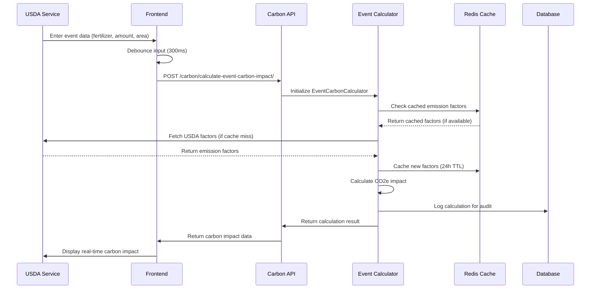
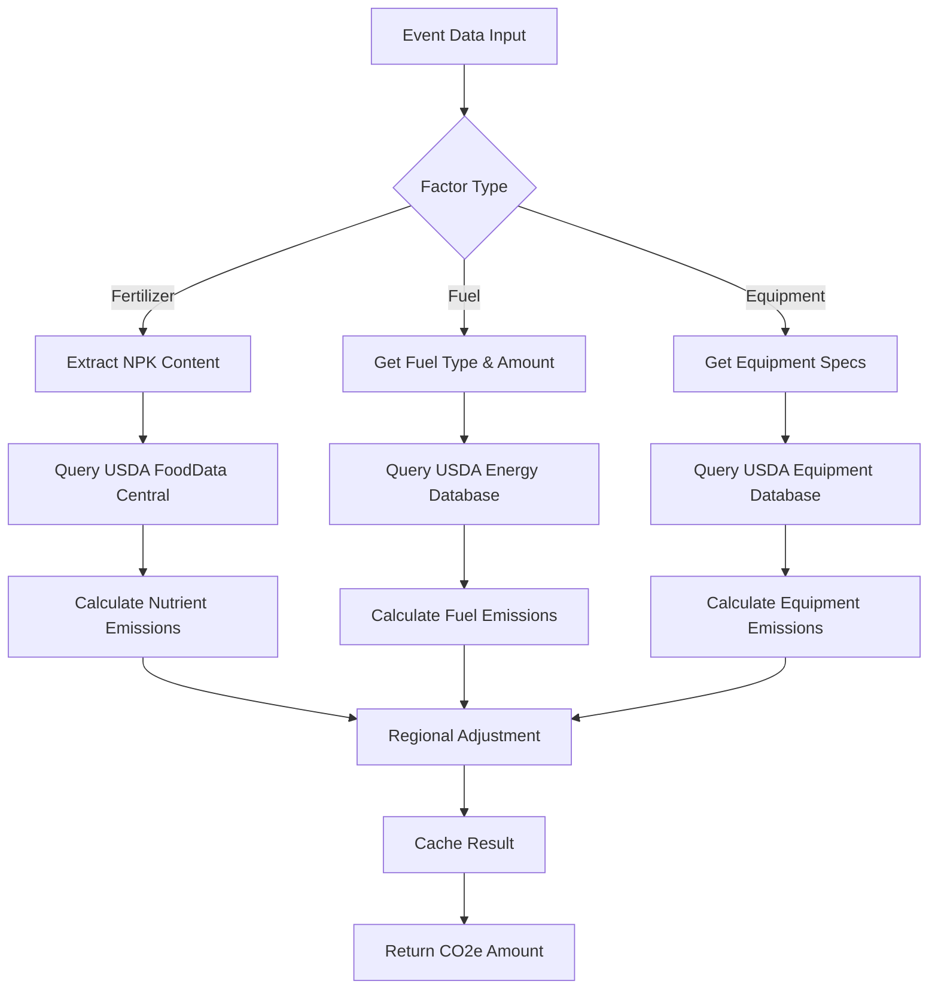
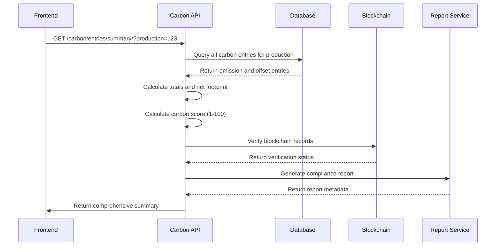
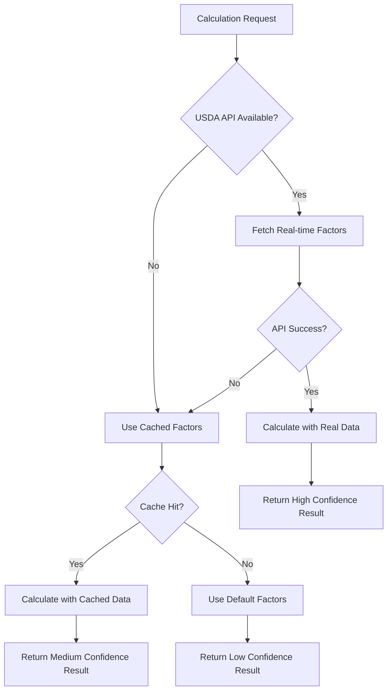

# Carbon Calculation Flow

## Overview and Purpose

The Carbon Calculation Flow is the core of Trazo's agricultural carbon transparency platform. It provides real-time carbon impact calculations using USDA-verified emission factors, supports multiple event types, and maintains data accuracy through sophisticated caching and verification systems.

## Technical Architecture

### Backend Components
- **carbon/services/event_carbon_calculator.py**: Core calculation engine
- **carbon/services/enhanced_usda_factors.py**: USDA API integration
- **carbon/services/calculator.py**: Legacy calculation support
- **carbon/models.py**: Carbon data models and emission factors
- **carbon/views.py**: API endpoints for calculations
- **carbon/services/usda_cache_service.py**: Caching layer

### Frontend Components
- **hooks/useDebouncedCarbonCalculation.ts**: Real-time calculation hook
- **store/api/carbonApi.ts**: RTK Query carbon API
- **components/Events/CarbonImpactPreview.tsx**: Live calculation display
- **components/Carbon/**: Carbon visualization components

## Step-by-Step Process

### 1. Real-Time Event Carbon Calculation



#### Real-Time Calculation API
- **Endpoint**: `POST /carbon/calculate-event-carbon-impact/`
- **Payload**:
```json
{
  "event_type": "chemical",
  "event_data": {
    "type": "FE",
    "commercial_name": "10-10-10 NPK",
    "volume": "100 liters",
    "concentration": "10-10-10",
    "area": "1 hectare",
    "way_of_application": "broadcast"
  }
}
```

- **Response**:
```json
{
  "co2e": 45.7,
  "efficiency_score": 75.2,
  "usda_verified": true,
  "calculation_method": "usda_enhanced_factors",
  "breakdown": {
    "nitrogen": 32.1,
    "phosphorus": 8.4,
    "potassium": 5.2
  },
  "recommendations": [
    "Consider precision application to reduce usage by 15%",
    "Switch to slow-release fertilizer for 20% efficiency gain"
  ],
  "event_type": "chemical",
  "timestamp": "2025-06-27T10:30:00Z"
}
```

### 2. USDA Emission Factor Integration



### 3. Event-Specific Calculation Methods

#### Chemical Event Calculation
```python
def calculate_chemical_event_impact(self, event):
    """Calculate carbon impact for chemical applications"""
    
    # Extract fertilizer composition
    composition = self._parse_fertilizer_composition(event.concentration)
    area_hectares = self._parse_area(event.area)
    volume_liters = self._parse_volume(event.volume)
    
    # Get USDA emission factors
    factors = self.usda_service.get_fertilizer_factors(
        nitrogen_percent=composition['N'],
        phosphorus_percent=composition['P'],
        potassium_percent=composition['K']
    )
    
    # Calculate emissions per nutrient
    emissions = {
        'nitrogen': (volume_liters * composition['N'] / 100) * factors['N_factor'],
        'phosphorus': (volume_liters * composition['P'] / 100) * factors['P_factor'],
        'potassium': (volume_liters * composition['K'] / 100) * factors['K_factor']
    }
    
    total_co2e = sum(emissions.values()) * area_hectares
    
    return {
        'co2e': total_co2e,
        'breakdown': emissions,
        'efficiency_score': self._calculate_efficiency_score(event, total_co2e),
        'usda_verified': factors['usda_verified']
    }
```

#### Equipment Event Calculation
```python
def calculate_equipment_event_impact(self, event):
    """Calculate carbon impact for equipment usage"""
    
    fuel_type = event.fuel_type or 'diesel'
    fuel_amount = self._parse_fuel_amount(event.fuel_amount)
    hours_used = event.hours_used or 2
    
    # Get USDA fuel emission factors
    fuel_factors = self.usda_service.get_fuel_factors(fuel_type)
    
    # Calculate direct fuel emissions
    fuel_emissions = fuel_amount * fuel_factors['co2e_per_liter']
    
    # Add equipment efficiency factors
    equipment_factor = self._get_equipment_efficiency_factor(event.equipment_name)
    total_co2e = fuel_emissions * equipment_factor
    
    return {
        'co2e': total_co2e,
        'fuel_emissions': fuel_emissions,
        'efficiency_factor': equipment_factor,
        'usda_verified': fuel_factors['usda_verified']
    }
```

### 4. Production-Level Carbon Summary



#### Production Summary Response
```json
{
  "total_emissions": 1247.5,
  "total_offsets": 892.3,
  "net_carbon": 355.2,
  "carbon_score": 78,
  "industry_average": 1500.0,
  "percentile_ranking": 85,
  "verification_status": {
    "usda_verified": true,
    "blockchain_verified": true,
    "audit_status": "passed"
  },
  "breakdown": {
    "fertilizer": 623.8,
    "fuel": 445.7,
    "equipment": 178.0,
    "cover_crops": -234.5,
    "carbon_credits": -657.8
  },
  "recommendations": [
    "Consider precision fertilizer application",
    "Implement cover cropping for additional sequestration"
  ]
}
```

## Database Models

### CarbonEntry Model
```python
class CarbonEntry(models.Model):
    TYPE_CHOICES = (
        ('emission', 'Emission'),
        ('offset', 'Offset'),
    )
    
    establishment = ForeignKey(Establishment, on_delete=CASCADE)
    production = ForeignKey(History, on_delete=CASCADE)
    created_by = ForeignKey(User, on_delete=SET_NULL)
    type = CharField(max_length=10, choices=TYPE_CHOICES)
    source = ForeignKey(CarbonSource, on_delete=SET_NULL)
    amount = FloatField(help_text='Amount in kg CO2e')
    co2e_amount = FloatField(default=0.0)
    year = IntegerField()
    timestamp = DateTimeField(default=timezone.now)
    
    # USDA verification fields
    usda_verified = BooleanField(default=False)
    usda_factors_based = BooleanField(default=False)
    verification_status = CharField(max_length=50, default='estimated')
    data_source = CharField(max_length=200, default='Unknown')
    
    # Trust score for offsets
    trust_score = FloatField(default=0.5, validators=[MinValueValidator(0.0), MaxValueValidator(1.0)])
    effective_amount = FloatField(null=True, blank=True)
```

### CarbonSource Model
```python
class CarbonSource(models.Model):
    name = CharField(max_length=100, unique=True)
    description = TextField(blank=True)
    unit = CharField(max_length=50)
    category = CharField(max_length=50)
    default_emission_factor = FloatField(default=0.0)
    usda_verified = BooleanField(default=False)
    usda_factors_based = BooleanField(default=False)
    verification_status = CharField(max_length=50, default='estimated')
    data_source = CharField(max_length=200, default='Unknown')
```

### RegionalEmissionFactor Model
```python
class RegionalEmissionFactor(models.Model):
    FACTOR_TYPES = [
        ('nitrogen', 'Nitrogen Fertilizer'),
        ('phosphorus', 'Phosphorus Fertilizer'),
        ('diesel', 'Diesel Fuel'),
        ('electricity', 'Electricity'),
    ]
    
    state = CharField(max_length=2)
    county = CharField(max_length=100, blank=True)
    crop_type = CharField(max_length=100)
    factor_type = CharField(max_length=20, choices=FACTOR_TYPES)
    emission_factor = FloatField()
    unit = CharField(max_length=50)
    adjustment_factor = FloatField(default=1.0)
    data_source = CharField(max_length=20, default='estimated')
    usda_verified = BooleanField(default=False)
    confidence_level = FloatField(default=0.8)
    valid_from = DateField()
    valid_until = DateField(null=True, blank=True)
```

## USDA API Integration

### FoodData Central Integration
```python
class EnhancedUSDAFactors:
    def get_fertilizer_factors(self, nitrogen_percent, phosphorus_percent, potassium_percent):
        """Get emission factors from USDA FoodData Central"""
        
        cache_key = f"usda_fertilizer_{nitrogen_percent}_{phosphorus_percent}_{potassium_percent}"
        cached_factors = cache.get(cache_key)
        
        if cached_factors:
            return cached_factors
        
        # Query USDA API for nutrient emission factors
        factors = {
            'N_factor': self._get_nitrogen_emission_factor(),
            'P_factor': self._get_phosphorus_emission_factor(),
            'K_factor': self._get_potassium_emission_factor(),
            'usda_verified': True
        }
        
        # Cache for 24 hours
        cache.set(cache_key, factors, 86400)
        return factors
```

### API Rate Limiting and Circuit Breaker
```python
class USDAAPIService:
    def __init__(self):
        self.rate_limiter = RateLimiter(requests_per_minute=100)
        self.circuit_breaker = CircuitBreaker(failure_threshold=5, timeout=60)
    
    @circuit_breaker
    @rate_limiter
    def fetch_emission_factor(self, factor_type, parameters):
        """Fetch emission factor with rate limiting and circuit breaker"""
        
        try:
            response = requests.get(
                f"{settings.USDA_API_BASE_URL}/factors",
                params=parameters,
                headers={'X-API-Key': settings.USDA_API_KEY},
                timeout=10
            )
            
            if response.status_code == 429:  # Rate limited
                raise RateLimitError("USDA API rate limit exceeded")
            
            response.raise_for_status()
            return response.json()
            
        except requests.RequestException as e:
            logger.error(f"USDA API error: {e}")
            raise USDAAPIError(f"Failed to fetch emission factor: {e}")
```

## Caching Strategy

### Multi-Level Caching
```python
# Level 1: In-Memory Cache (fastest)
@lru_cache(maxsize=1000)
def get_basic_emission_factor(factor_type, value):
    return calculate_basic_factor(factor_type, value)

# Level 2: Redis Cache (shared across instances)
def get_cached_usda_factor(factor_key):
    cache_key = f"usda_factor_{factor_key}"
    factor = cache.get(cache_key)
    
    if not factor:
        factor = fetch_from_usda_api(factor_key)
        cache.set(cache_key, factor, 86400)  # 24 hour TTL
    
    return factor

# Level 3: Database Cache (persistent)
def get_regional_emission_factor(state, crop_type, factor_type):
    return RegionalEmissionFactor.objects.filter(
        state=state,
        crop_type=crop_type,
        factor_type=factor_type,
        valid_from__lte=timezone.now().date()
    ).first()
```

### Cache Invalidation Strategy
```python
def invalidate_carbon_cache(production_id):
    """Invalidate all carbon-related caches for a production"""
    
    cache_patterns = [
        f"carbon_summary_{production_id}",
        f"carbon_entries_{production_id}",
        f"carbon_score_{production_id}",
        f"usda_factors_{production_id}_*"
    ]
    
    for pattern in cache_patterns:
        cache.delete_many(cache.keys(pattern))
```

## Error Handling

### Calculation Error Recovery


### Error Response Structure
```json
{
  "co2e": 45.7,
  "confidence_level": "medium",
  "warnings": [
    "USDA API temporarily unavailable, using cached factors",
    "Regional adjustment factor not available for this area"
  ],
  "fallback_used": true,
  "data_sources": {
    "nitrogen_factor": "cached_usda_2025_06_26",
    "phosphorus_factor": "default_estimate",
    "regional_adjustment": "none"
  }
}
```

## Performance Optimization

### Calculation Performance Metrics
- **Real-time calculation**: <500ms for simple events
- **Complex production summary**: <2s with caching
- **USDA API calls**: <1s with circuit breaker
- **Cache hit ratio**: >90% for common factors

### Database Optimization
```sql
-- Indexes for fast carbon entry queries
CREATE INDEX carbon_entry_production_year_idx ON carbon_carbonentry(production_id, year);
CREATE INDEX carbon_entry_type_amount_idx ON carbon_carbonentry(type, amount);
CREATE INDEX carbon_source_category_idx ON carbon_carbonsource(category, usda_verified);

-- Partial index for active emission factors
CREATE INDEX regional_factor_active_idx ON carbon_regionalemissionfactor(state, crop_type, factor_type) 
WHERE valid_until IS NULL OR valid_until > CURRENT_DATE;
```

### Frontend Performance
```typescript
// Debounced calculation hook
export const useDebouncedCarbonCalculation = (eventData, delay = 300) => {
  const [result, setResult] = useState(null);
  const [isCalculating, setIsCalculating] = useState(false);
  
  const debouncedEventData = useDebounce(eventData, delay);
  
  const { data, error, isLoading } = useCalculateEventCarbonMutation(
    debouncedEventData,
    { skip: !debouncedEventData }
  );
  
  useEffect(() => {
    setIsCalculating(isLoading);
    if (data) setResult(data);
  }, [data, isLoading]);
  
  return { result, isCalculating, error };
};
```

## Security Considerations

### API Security
- **Rate Limiting**: 10 requests/minute for calculation endpoints
- **Input Validation**: Strict validation of all calculation parameters
- **Authentication**: All calculation endpoints require authentication
- **Audit Logging**: All calculations logged for compliance

### Data Integrity
```python
def validate_calculation_inputs(event_data):
    """Validate calculation inputs for security"""
    
    validators = {
        'amount': lambda x: 0 < float(x) < 10000,
        'area': lambda x: 0 < parse_area(x) < 1000,
        'concentration': lambda x: validate_fertilizer_concentration(x)
    }
    
    for field, validator in validators.items():
        if field in event_data and not validator(event_data[field]):
            raise ValidationError(f"Invalid {field}: {event_data[field]}")
```

## Testing Scenarios

### Unit Tests
1. **Fertilizer Calculation**: NPK emission factor calculations
2. **Fuel Calculation**: Equipment fuel consumption calculations
3. **Regional Factors**: State-specific emission factor adjustments
4. **Cache Behavior**: Cache hit/miss scenarios

### Integration Tests
1. **USDA API Integration**: Real API calls with fallback testing
2. **Database Performance**: Large-scale calculation queries
3. **Error Recovery**: API failure and cache invalidation scenarios

### Performance Tests
1. **Load Testing**: 1000+ concurrent calculation requests
2. **Cache Performance**: Cache hit ratio under load
3. **API Response Times**: End-to-end calculation timing

---

*Last Updated: 2025-06-27*
*Flow Version: 1.0*