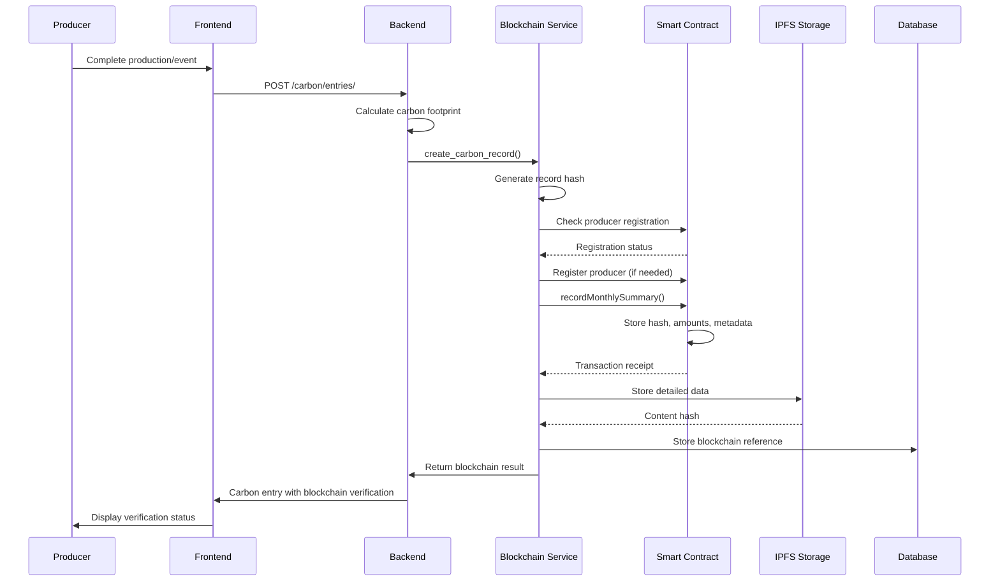
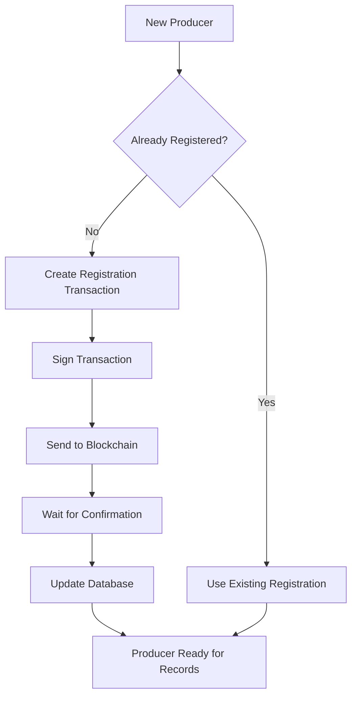
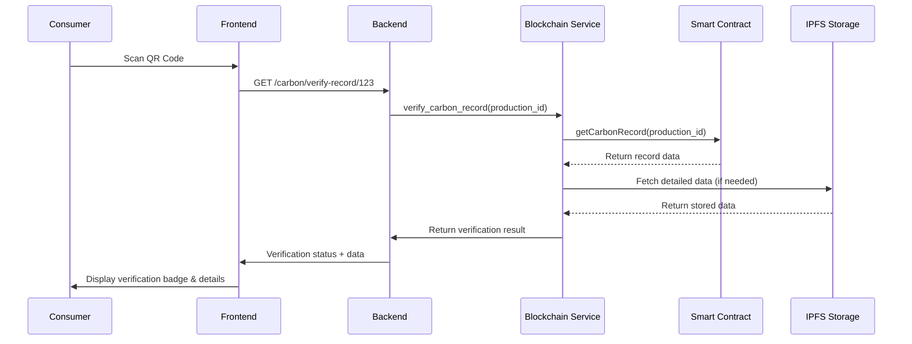
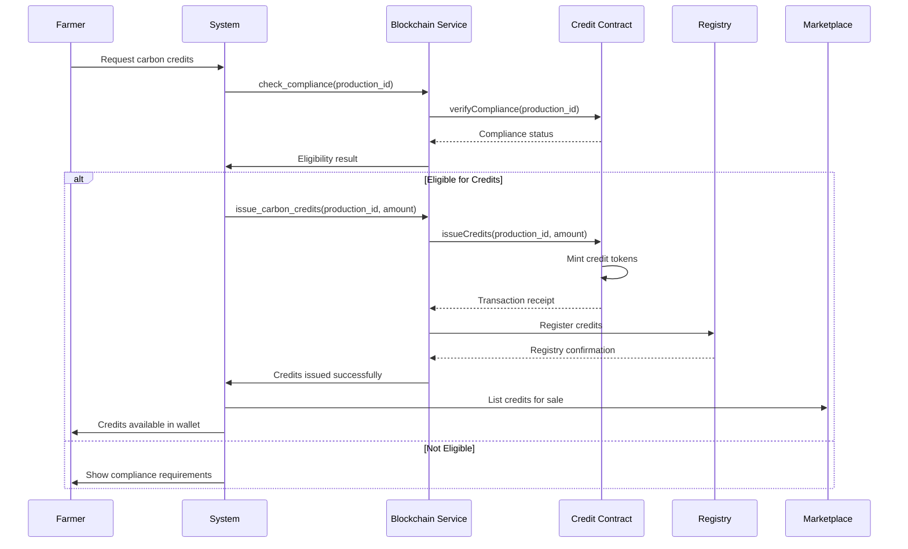
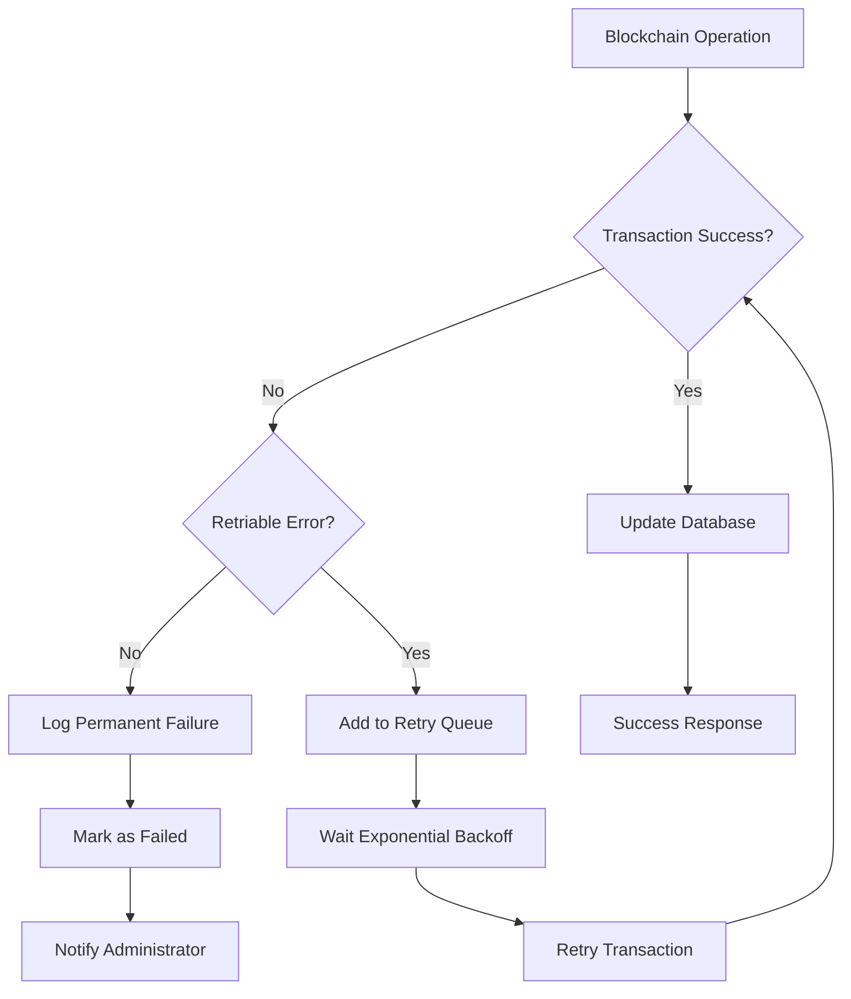

# Blockchain Verification Flow

## Overview and Purpose

The Blockchain Verification Flow creates immutable carbon records on the Polygon network, enabling transparent and verifiable carbon footprint tracking. This flow integrates with smart contracts to ensure data integrity and supports carbon credit issuance for verified sustainable practices.

## Technical Architecture

### Backend Components
- **carbon/services/blockchain.py**: Main blockchain service
- **carbon/services/secure_key_management.py**: Secure private key handling
- **carbon/services/multisig_blockchain_service.py**: Multi-signature support
- **carbon/services/gas_optimized_blockchain.py**: Gas optimization
- **contracts/CarbonVerification.sol**: Smart contract
- **contracts/CarbonCreditToken.sol**: Carbon credit token contract

### Frontend Components
- **components/BlockchainVerificationBadge/**: Verification display
- **test-blockchain-complete.tsx**: Blockchain testing interface
- **store/api/carbonApi.ts**: Blockchain API integration

### Infrastructure
- **Polygon Amoy Testnet**: Development and testing
- **Polygon Mainnet**: Production deployment
- **IPFS**: Off-chain data storage
- **Web3 Provider**: Blockchain connection management

## Step-by-Step Process

### 1. Carbon Record Creation Flow



#### Blockchain Record Creation API
- **Endpoint**: `POST /carbon/entries/`
- **Enhanced Response** (with blockchain):
```json
{
  "id": 123,
  "amount": 1247.5,
  "type": "emission",
  "blockchain_verification": {
    "transaction_hash": "0x742d35cc6527c7b8e2c6e3b6c7e8d9f0a1b2c3d4e5f6789",
    "record_hash": "a1b2c3d4e5f67890123456789abcdef0123456789abcdef",
    "block_number": 45123456,
    "gas_used": 185000,
    "verification_url": "https://amoy.polygonscan.com/tx/0x742d35cc...",
    "blockchain_verified": true,
    "network": "polygon_amoy",
    "contract_address": "0x1234567890abcdef1234567890abcdef12345678"
  }
}
```

### 2. Smart Contract Integration

#### CarbonVerification.sol Structure
```solidity
pragma solidity ^0.8.0;

contract CarbonVerification {
    struct CarbonRecord {
        bytes32 dataHash;
        uint256 producerId;
        uint256 productionId;
        uint256 totalEmissions;    // in grams
        uint256 totalOffsets;      // in grams
        int256 netFootprint;       // in grams (can be negative)
        string cropType;
        bool usdaCompliant;
        bool creditsIssued;
        uint256 creditsAmount;     // in grams CO2e
        uint256 timestamp;
        address verifier;
    }
    
    mapping(uint256 => CarbonRecord) public carbonRecords;
    mapping(uint256 => address) public producers;
    
    event CarbonRecorded(
        uint256 indexed productionId,
        bytes32 indexed dataHash,
        uint256 totalEmissions,
        uint256 totalOffsets,
        address indexed verifier
    );
    
    function recordMonthlySummary(
        bytes32 _dataHash,
        uint256 _producerId,
        uint256 _productionId,
        uint256 _totalEmissions,
        uint256 _totalOffsets,
        string memory _cropType
    ) external onlyVerifier returns (bool) {
        // Implementation details...
    }
}
```

### 3. Producer Registration Flow



#### Producer Registration Code
```python
def register_producer(self, producer_id, producer_address):
    """Register a new producer on the blockchain"""
    try:
        # Check if producer is already registered
        producer_info = self.contract.functions.getProducer(producer_id).call()
        if producer_info[0] != '0x0000000000000000000000000000000000000000':
            return {'success': True, 'message': 'Producer already registered'}
        
        # Build registration transaction
        transaction = self.contract.functions.registerProducer(
            producer_id, 
            producer_address
        ).buildTransaction({
            'from': self.account.address,
            'gas': 100000,
            'gasPrice': self.web3.toWei('2', 'gwei'),
            'nonce': self.web3.eth.getTransactionCount(self.account.address)
        })
        
        # Sign and send transaction
        blockchain_private_key = get_secure_blockchain_key()
        signed_tx = self.web3.eth.account.signTransaction(transaction, blockchain_private_key)
        tx_hash = self.web3.eth.sendRawTransaction(signed_tx.rawTransaction)
        
        # Wait for confirmation
        receipt = self.web3.eth.waitForTransactionReceipt(tx_hash, timeout=120)
        
        return {
            'success': True,
            'transaction_hash': tx_hash.hex(),
            'block_number': receipt['blockNumber'],
            'producer_id': producer_id
        }
        
    except Exception as e:
        logger.error(f"Producer registration failed: {e}")
        raise BlockchainOperationError(f"Failed to register producer: {e}")
```

### 4. Carbon Record Verification Flow



#### Verification Response
```json
{
  "verified": true,
  "record_hash": "a1b2c3d4e5f67890123456789abcdef0123456789abcdef",
  "total_emissions": 1247.5,
  "total_offsets": 892.3,
  "net_footprint": 355.2,
  "crop_type": "Citrus (Oranges)",
  "usda_compliant": true,
  "credits_issued": false,
  "credits_amount": 0,
  "timestamp": 1719489600,
  "blockchain_verified": true,
  "verification_url": "https://amoy.polygonscan.com/tx/0x742d35cc...",
  "network": "polygon_amoy",
  "confidence_score": 0.95
}
```

### 5. Carbon Credit Issuance Flow



## Database Integration

### Blockchain Reference Storage
```python
class CarbonEntry(models.Model):
    # ... existing fields ...
    
    # Blockchain verification fields
    blockchain_transaction_hash = CharField(max_length=66, blank=True)
    blockchain_verified = BooleanField(default=False)
    blockchain_record_hash = CharField(max_length=64, blank=True)
    blockchain_block_number = IntegerField(null=True, blank=True)
    blockchain_gas_used = IntegerField(null=True, blank=True)
    blockchain_network = CharField(max_length=20, default='polygon_amoy')
    
    @property
    def blockchain_explorer_url(self):
        if self.blockchain_transaction_hash:
            base_url = settings.POLYGON_EXPLORER_URL
            return f"{base_url}/tx/{self.blockchain_transaction_hash}"
        return None
```

### Blockchain Audit Log
```python
class BlockchainAuditLog(models.Model):
    carbon_entry = ForeignKey(CarbonEntry, on_delete=CASCADE)
    transaction_hash = CharField(max_length=66)
    operation_type = CharField(max_length=50)  # 'record', 'verify', 'issue_credits'
    gas_used = IntegerField()
    gas_price = CharField(max_length=20)
    block_number = IntegerField()
    network = CharField(max_length=20)
    success = BooleanField(default=True)
    error_message = TextField(blank=True)
    created_at = DateTimeField(auto_now_add=True)
```

## Security Implementation

### Secure Key Management
```python
class SecureKeyManager:
    def __init__(self):
        self.key_vault_url = settings.KEY_VAULT_URL
        self.encryption_key = self._get_encryption_key()
    
    def get_blockchain_private_key(self):
        """Retrieve blockchain private key securely"""
        try:
            # Use AWS KMS or Azure Key Vault in production
            if settings.USE_KEY_VAULT:
                return self._get_key_from_vault('blockchain_private_key')
            else:
                # Encrypted environment variable fallback
                encrypted_key = settings.BLOCKCHAIN_PRIVATE_KEY_ENCRYPTED
                return self._decrypt_key(encrypted_key)
        except Exception as e:
            logger.error(f"Failed to retrieve blockchain key: {e}")
            raise SecurityError("Blockchain key unavailable")
    
    def _decrypt_key(self, encrypted_key):
        """Decrypt private key using AES encryption"""
        from cryptography.fernet import Fernet
        fernet = Fernet(self.encryption_key)
        return fernet.decrypt(encrypted_key.encode()).decode()
```

### Multi-Signature Implementation
```python
class MultisigBlockchainService:
    def __init__(self):
        self.required_signatures = 2
        self.authorized_signers = settings.AUTHORIZED_BLOCKCHAIN_SIGNERS
    
    def create_multisig_transaction(self, operation_data):
        """Create transaction requiring multiple signatures"""
        transaction_id = str(uuid.uuid4())
        
        # Store pending transaction
        pending_tx = {
            'id': transaction_id,
            'operation': operation_data,
            'signatures': [],
            'created_at': timezone.now(),
            'status': 'pending'
        }
        
        cache.set(f"pending_tx_{transaction_id}", pending_tx, 3600)
        
        # Notify authorized signers
        for signer in self.authorized_signers:
            send_signature_request(signer, transaction_id, operation_data)
        
        return transaction_id
```

## Gas Optimization

### Gas-Efficient Contract Design
```solidity
contract GasOptimizedCarbon {
    // Pack structs to minimize storage slots
    struct PackedCarbonRecord {
        uint128 totalEmissions;  // Sufficient for realistic values
        uint128 totalOffsets;
        uint64 timestamp;
        uint32 producerId;
        uint32 productionId;
        bytes32 dataHash;
        bool usdaCompliant;
        bool creditsIssued;
    }
    
    // Use events for data that doesn't need on-chain storage
    event DetailedCarbonData(
        uint256 indexed productionId,
        string cropType,
        string calculationMethod,
        string ipfsHash
    );
    
    // Batch operations to reduce gas costs
    function batchRecordCarbonData(
        PackedCarbonRecord[] calldata records
    ) external onlyVerifier {
        for (uint i = 0; i < records.length; i++) {
            _recordCarbonData(records[i]);
        }
    }
}
```

### Gas Price Management
```python
def get_optimal_gas_price(self):
    """Get optimal gas price based on network conditions"""
    try:
        # Get current gas price from blockchain
        current_gas_price = self.web3.eth.gas_price
        
        # Apply network-specific optimizations
        if self.network_name == 'polygon_amoy':
            # Polygon typically has low gas prices
            optimal_price = max(current_gas_price, self.web3.toWei('2', 'gwei'))
        else:
            # Adjust based on urgency and network congestion
            optimal_price = int(current_gas_price * 1.1)  # 10% above current
        
        return optimal_price
    except Exception as e:
        logger.warning(f"Gas price estimation failed: {e}")
        return self.web3.toWei('20', 'gwei')  # Safe fallback
```

## Error Handling and Recovery

### Blockchain Failure Recovery


### Error Recovery Implementation
```python
class BlockchainRetryService:
    def __init__(self):
        self.max_retries = 3
        self.base_delay = 2  # seconds
    
    def retry_failed_transaction(self, operation_data, attempt=1):
        """Retry failed blockchain operation with exponential backoff"""
        try:
            if attempt > self.max_retries:
                raise MaxRetriesExceeded(f"Failed after {self.max_retries} attempts")
            
            # Execute blockchain operation
            result = self._execute_blockchain_operation(operation_data)
            
            # Clear from retry queue on success
            self._clear_retry_queue(operation_data['id'])
            return result
            
        except (BlockchainConnectionError, GasEstimationError) as e:
            # Retriable errors
            delay = self.base_delay * (2 ** (attempt - 1))
            logger.warning(f"Blockchain operation failed, retrying in {delay}s: {e}")
            
            # Schedule retry
            schedule_retry.apply_async(
                args=[operation_data, attempt + 1],
                countdown=delay
            )
            
        except (InvalidTransactionError, InsufficientFundsError) as e:
            # Non-retriable errors
            logger.error(f"Permanent blockchain failure: {e}")
            self._mark_as_permanently_failed(operation_data, str(e))
            raise
```

## Performance Monitoring

### Blockchain Performance Metrics
```python
class BlockchainMetrics:
    def track_transaction_performance(self, operation_type, start_time, gas_used, success):
        """Track blockchain operation performance"""
        duration = time.time() - start_time
        
        metrics = {
            'operation_type': operation_type,
            'duration_seconds': duration,
            'gas_used': gas_used,
            'success': success,
            'timestamp': timezone.now(),
            'network': self.network_name
        }
        
        # Send to monitoring system
        self._send_to_datadog(metrics)
        
        # Store in database for analysis
        BlockchainMetric.objects.create(**metrics)
        
        # Alert on performance issues
        if duration > 30:  # 30 seconds threshold
            self._send_performance_alert(operation_type, duration)
```

### Expected Performance Targets
- **Transaction Confirmation**: <30 seconds on Polygon
- **Gas Costs**: <$0.01 per carbon record
- **Throughput**: 100+ records per minute
- **Uptime**: 99.9% blockchain service availability

## Frontend Integration

### Blockchain Verification Badge Component
```typescript
interface BlockchainVerificationBadgeProps {
  carbonEntry: CarbonEntry;
  showDetails?: boolean;
}

export const BlockchainVerificationBadge: React.FC<BlockchainVerificationBadgeProps> = ({
  carbonEntry,
  showDetails = false
}) => {
  const { blockchain_verified, blockchain_transaction_hash, blockchain_explorer_url } = carbonEntry;
  
  if (!blockchain_verified) {
    return (
      <Badge colorScheme="gray" variant="outline">
        <Icon as={FiClock} mr={1} />
        Verification Pending
      </Badge>
    );
  }
  
  return (
    <VStack spacing={2} align="start">
      <Badge colorScheme="green">
        <Icon as={FiShield} mr={1} />
        Blockchain Verified
      </Badge>
      
      {showDetails && (
        <VStack spacing={1} align="start" fontSize="sm">
          <Text>
            Hash: {blockchain_transaction_hash?.slice(0, 10)}...
          </Text>
          <Link href={blockchain_explorer_url} isExternal color="blue.500">
            View on Explorer <ExternalLinkIcon mx="2px" />
          </Link>
        </VStack>
      )}
    </VStack>
  );
};
```

## Testing Strategy

### Smart Contract Testing
```solidity
// Test contract for carbon verification
contract TestCarbonVerification {
    CarbonVerification public carbonContract;
    
    function setUp() public {
        carbonContract = new CarbonVerification();
    }
    
    function testRecordCarbonData() public {
        uint256 productionId = 123;
        bytes32 dataHash = keccak256("test_data");
        
        carbonContract.recordMonthlySummary(
            dataHash,
            1, // producerId
            productionId,
            1000, // emissions in grams
            500,  // offsets in grams
            "Citrus"
        );
        
        CarbonVerification.CarbonRecord memory record = 
            carbonContract.getCarbonRecord(productionId);
        
        assert(record.dataHash == dataHash);
        assert(record.totalEmissions == 1000);
        assert(record.totalOffsets == 500);
    }
}
```

### Integration Testing
```python
class TestBlockchainIntegration(TestCase):
    def setUp(self):
        self.blockchain_service = BlockchainCarbonService()
        self.test_production_id = 123
        
    def test_carbon_record_creation(self):
        """Test complete carbon record creation flow"""
        carbon_data = {
            'production_id': self.test_production_id,
            'total_emissions': 1247.5,
            'total_offsets': 892.3,
            'crop_type': 'Citrus',
            'usda_verified': True
        }
        
        result = self.blockchain_service.create_carbon_record(
            self.test_production_id,
            carbon_data
        )
        
        self.assertTrue(result['blockchain_verified'])
        self.assertIsNotNone(result['transaction_hash'])
        self.assertIn('0x', result['transaction_hash'])
        
    def test_verification_flow(self):
        """Test carbon record verification"""
        # First create a record
        self.test_carbon_record_creation()
        
        # Then verify it
        verification = self.blockchain_service.verify_carbon_record(
            self.test_production_id
        )
        
        self.assertTrue(verification['verified'])
        self.assertTrue(verification['blockchain_verified'])
```

---

*Last Updated: 2025-06-27*
*Flow Version: 1.0*