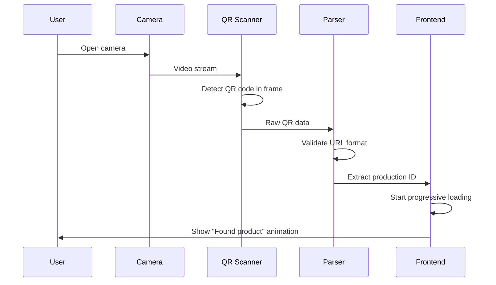
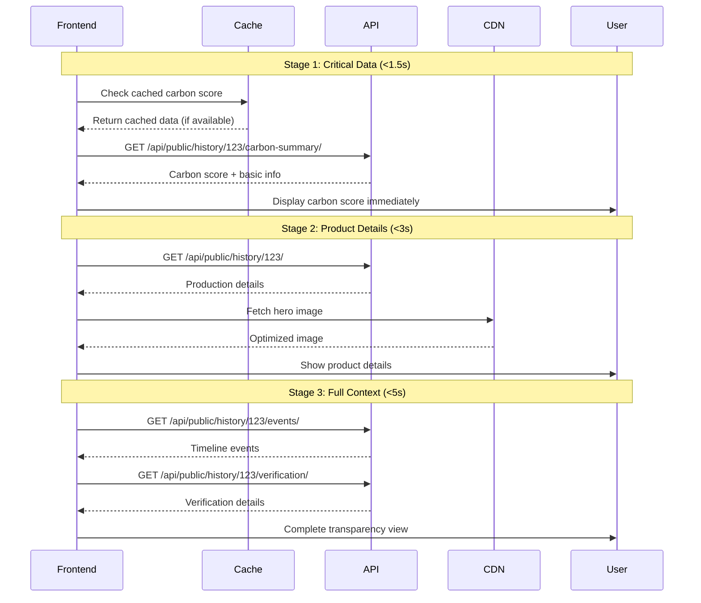
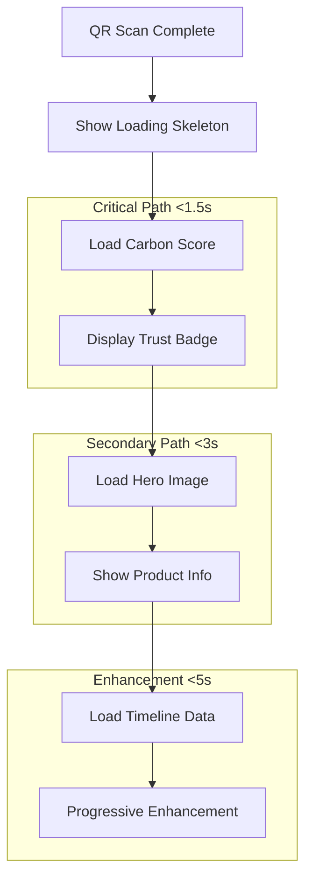
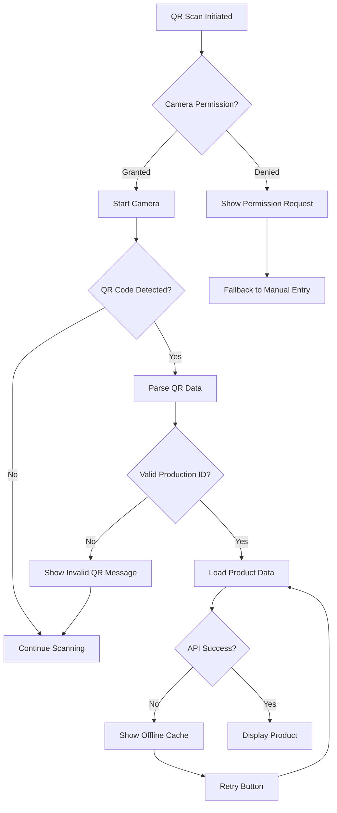

# QR Code Scanning Flow

## Overview and Purpose

The QR Code Scanning Flow enables consumers to access transparent carbon footprint information by scanning QR codes on agricultural products. This mobile-optimized flow prioritizes fast loading times, progressive information disclosure, and trust-first design to build consumer confidence in sustainable agriculture.

## Technical Architecture

### Frontend Components
- **components/QRScanner/**: Complete QR scanning system
- **views/Scan/ProductDetail/**: Product information display
- **hooks/useMobileQROptimizations.ts**: Performance optimizations
- **hooks/useProgressiveLoading.ts**: Progressive data loading
- **components/ProductDetail/**: Trust-first product display

### Backend Components
- **history/views.py**: Public production endpoints
- **carbon/views.py**: Carbon data APIs
- **common/views.py**: Image and media serving
- **store/api/optimizedQrApi.ts**: Optimized API calls

### Performance Infrastructure
- **CDN**: Image and static asset delivery
- **Redis Cache**: Hot data caching
- **Progressive Loading**: Staged data fetching
- **Mobile Optimization**: Lighthouse 90+ score target

## Step-by-Step Process

### 1. QR Code Detection and Scanning



#### QR Scanner Implementation
```typescript
export const QRScanner: React.FC<QRScannerProps> = ({ onScan, onError }) => {
  const [isScanning, setIsScanning] = useState(false);
  const [lastScan, setLastScan] = useState<string | null>(null);
  const videoRef = useRef<HTMLVideoElement>(null);
  
  const startScanning = useCallback(async () => {
    try {
      setIsScanning(true);
      
      // Request camera permissions
      const stream = await navigator.mediaDevices.getUserMedia({
        video: { 
          facingMode: 'environment', // Back camera
          width: { ideal: 1280 },
          height: { ideal: 720 }
        }
      });
      
      if (videoRef.current) {
        videoRef.current.srcObject = stream;
        
        // Initialize QR code scanner
        const html5QrCode = new Html5Qrcode("qr-scanner");
        
        await html5QrCode.start(
          { facingMode: "environment" },
          {
            fps: 10,
            qrbox: { width: 250, height: 250 },
            aspectRatio: 1.0
          },
          (decodedText) => {
            if (decodedText !== lastScan) {
              setLastScan(decodedText);
              handleQRCodeDetected(decodedText);
            }
          },
          (errorMessage) => {
            // Handle scan errors silently
            console.debug('QR scan error:', errorMessage);
          }
        );
      }
    } catch (error) {
      onError?.('Camera access denied or unavailable');
      setIsScanning(false);
    }
  }, [lastScan, onError]);
  
  const handleQRCodeDetected = (qrData: string) => {
    const productionId = extractProductionId(qrData);
    if (productionId) {
      // Haptic feedback on mobile
      if ('vibrate' in navigator) {
        navigator.vibrate(50);
      }
      
      onScan?.(productionId);
    }
  };
  
  return (
    <Box position="relative" w="100%" h="100vh">
      <video
        ref={videoRef}
        autoPlay
        playsInline
        style={{ width: '100%', height: '100%', objectFit: 'cover' }}
      />
      
      {/* QR Code Overlay */}
      <Box
        position="absolute"
        top="50%"
        left="50%"
        transform="translate(-50%, -50%)"
        border="2px solid white"
        borderRadius="lg"
        width="250px"
        height="250px"
        pointerEvents="none"
      >
        <Box
          position="absolute"
          top="-2px"
          left="-2px"
          width="20px"
          height="20px"
          borderTop="4px solid #48BB78"
          borderLeft="4px solid #48BB78"
        />
        {/* Additional corner indicators */}
      </Box>
      
      {isScanning && (
        <Text
          position="absolute"
          bottom="20px"
          left="50%"
          transform="translateX(-50%)"
          color="white"
          bg="blackAlpha.700"
          px={4}
          py={2}
          borderRadius="md"
        >
          Point camera at QR code
        </Text>
      )}
    </Box>
  );
};
```

### 2. Progressive Loading Strategy



#### Progressive Loading Hook
```typescript
export const useProgressiveLoading = (productionId: string) => {
  const [stage, setStage] = useState<'loading' | 'carbon' | 'details' | 'complete'>('loading');
  const [data, setData] = useState<ProgressiveData>({});
  const [errors, setErrors] = useState<string[]>([]);

  // Stage 1: Critical carbon data
  const { data: carbonData, isLoading: carbonLoading } = useGetCarbonSummaryQuery(
    productionId,
    { skip: !productionId }
  );

  // Stage 2: Product details (starts after carbon data)
  const { data: productData, isLoading: productLoading } = useGetProductionQuery(
    productionId,
    { skip: !carbonData || stage === 'loading' }
  );

  // Stage 3: Additional context (starts after product details)
  const { data: eventsData } = useGetProductionEventsQuery(
    productionId,
    { skip: stage !== 'details' }
  );

  const { data: verificationData } = useGetVerificationDataQuery(
    productionId,
    { skip: stage !== 'details' }
  );

  useEffect(() => {
    if (carbonData && !carbonLoading) {
      setData(prev => ({ ...prev, carbon: carbonData }));
      setStage('carbon');
    }
  }, [carbonData, carbonLoading]);

  useEffect(() => {
    if (productData && !productLoading && stage === 'carbon') {
      setData(prev => ({ ...prev, product: productData }));
      setStage('details');
    }
  }, [productData, productLoading, stage]);

  useEffect(() => {
    if (eventsData && verificationData && stage === 'details') {
      setData(prev => ({ 
        ...prev, 
        events: eventsData, 
        verification: verificationData 
      }));
      setStage('complete');
    }
  }, [eventsData, verificationData, stage]);

  return {
    stage,
    data,
    errors,
    isLoading: stage === 'loading',
    carbonScore: data.carbon?.carbon_score,
    loadingProgress: {
      carbon: !!data.carbon,
      product: !!data.product,
      events: !!data.events,
      verification: !!data.verification
    }
  };
};
```

### 3. Mobile-Optimized Product Detail Display



#### Mobile Product Detail Component
```typescript
export const MobileProgressiveProductDetail: React.FC<Props> = ({ productionId }) => {
  const { stage, data, loadingProgress, carbonScore } = useProgressiveLoading(productionId);
  const { optimizedImages } = useMobileQROptimizations();

  return (
    <Box minH="100vh" bg="gray.50">
      {/* Stage 1: Carbon Score Hero (Critical) */}
      <TrustFirstHeader 
        carbonScore={carbonScore}
        isLoading={stage === 'loading'}
        productName={data.product?.name}
      />

      {/* Stage 2: Product Details */}
      {loadingProgress.product ? (
        <ProductDetailsSection 
          production={data.product}
          images={optimizedImages}
        />
      ) : (
        <ProductDetailsSkeleton />
      )}

      {/* Stage 3: Verification & Timeline */}
      {loadingProgress.verification && (
        <VerificationSection verification={data.verification} />
      )}

      {loadingProgress.events && (
        <TimelineSection events={data.events} />
      )}

      {/* Progressive Enhancement */}
      <Suspense fallback={<Skeleton height="200px" />}>
        <LazyEducationalContent carbonScore={carbonScore} />
      </Suspense>
    </Box>
  );
};
```

### 4. Trust-First Header Design

```typescript
interface TrustFirstHeaderProps {
  carbonScore?: number;
  isLoading: boolean;
  productName?: string;
}

export const TrustFirstHeader: React.FC<TrustFirstHeaderProps> = ({
  carbonScore,
  isLoading,
  productName
}) => {
  const getScoreColor = (score: number) => {
    if (score >= 80) return 'green';
    if (score >= 60) return 'yellow';
    return 'orange';
  };

  const getScoreMessage = (score: number) => {
    if (score >= 80) return 'Excellent Carbon Performance';
    if (score >= 60) return 'Good Carbon Performance';
    return 'Improving Carbon Performance';
  };

  if (isLoading) {
    return (
      <Box bg="white" p={6} textAlign="center">
        <Skeleton height="60px" width="60px" borderRadius="full" mx="auto" mb={4} />
        <Skeleton height="20px" width="200px" mx="auto" mb={2} />
        <Skeleton height="16px" width="150px" mx="auto" />
      </Box>
    );
  }

  return (
    <Box bg="white" p={6} textAlign="center" shadow="sm">
      {/* Carbon Score Badge */}
      <VStack spacing={3}>
        <Box position="relative">
          <CircularProgress
            value={carbonScore || 0}
            size="80px"
            color={getScoreColor(carbonScore || 0)}
            trackColor="gray.100"
            thickness="8px"
          >
            <CircularProgressLabel fontWeight="bold" fontSize="lg">
              {carbonScore || '--'}
            </CircularProgressLabel>
          </CircularProgress>
          
          {/* Verification Badge */}
          <Badge
            position="absolute"
            top="-2px"
            right="-2px"
            colorScheme="blue"
            borderRadius="full"
            p={1}
          >
            <Icon as={FiShield} />
          </Badge>
        </Box>

        <VStack spacing={1}>
          <Text fontWeight="bold" fontSize="lg">
            {getScoreMessage(carbonScore || 0)}
          </Text>
          <Text color="gray.600" fontSize="sm">
            Verified Carbon Footprint
          </Text>
        </VStack>

        {productName && (
          <Text fontWeight="semibold" color="gray.800">
            {productName}
          </Text>
        )}

        {/* Trust Indicators */}
        <HStack spacing={4} mt={4}>
          <TrustIndicator icon={FiCheck} label="USDA Verified" />
          <TrustIndicator icon={FiShield} label="Blockchain Secured" />
          <TrustIndicator icon={FiLeaf} label="Sustainable Farm" />
        </HStack>
      </VStack>
    </Box>
  );
};

const TrustIndicator: React.FC<{ icon: any; label: string }> = ({ icon, label }) => (
  <VStack spacing={1} minW="80px">
    <Icon as={icon} color="green.500" fontSize="lg" />
    <Text fontSize="xs" color="gray.600" textAlign="center">
      {label}
    </Text>
  </VStack>
);
```

## API Optimization

### Optimized QR API Endpoints
```python
class OptimizedQRViewSet(viewsets.ViewSet):
    """
    Optimized API endpoints specifically for QR code scanning.
    Focus on minimal data transfer and maximum caching.
    """
    
    @action(detail=True, methods=['get'])
    def carbon_summary(self, request, pk=None):
        """Ultra-fast carbon score endpoint - <500ms target"""
        cache_key = f'qr_carbon_summary_{pk}_v2'
        cached_data = cache.get(cache_key)
        
        if cached_data:
            return Response(cached_data)
        
        try:
            production = History.objects.select_related(
                'product', 'parcel__establishment'
            ).get(id=pk, published=True)
            
            # Minimal carbon calculation for speed
            carbon_entries = CarbonEntry.objects.filter(
                production=production
            ).aggregate(
                total_emissions=Sum('amount', filter=Q(type='emission')),
                total_offsets=Sum('effective_amount', filter=Q(type='offset'))
            )
            
            total_emissions = carbon_entries['total_emissions'] or 0
            total_offsets = carbon_entries['total_offsets'] or 0
            carbon_score = self._calculate_quick_score(total_emissions, total_offsets)
            
            summary = {
                'carbon_score': carbon_score,
                'total_emissions': total_emissions,
                'total_offsets': total_offsets,
                'net_carbon': total_emissions - total_offsets,
                'product_name': production.product.name if production.product else production.name,
                'farm_name': production.parcel.establishment.name if production.parcel else '',
                'verification_status': self._get_verification_status(production),
                'timestamp': timezone.now().isoformat()
            }
            
            # Cache for 1 hour
            cache.set(cache_key, summary, 3600)
            return Response(summary)
            
        except History.DoesNotExist:
            return Response({'error': 'Production not found'}, status=404)
    
    def _calculate_quick_score(self, emissions, offsets):
        """Quick carbon score calculation optimized for speed"""
        if emissions == 0 and offsets == 0:
            return 50
        
        if emissions == 0:
            return 95
        
        offset_ratio = offsets / emissions
        if offset_ratio >= 1.0:
            return min(95, 50 + (offset_ratio * 45))
        else:
            return max(10, offset_ratio * 50)
```

### CDN Integration for Images
```python
class OptimizedImageServing:
    def get_optimized_image_url(self, image_field, size='medium'):
        """Generate CDN URLs for optimized images"""
        
        if not image_field:
            return self.get_placeholder_image(size)
        
        # Generate different sizes for responsive loading
        size_configs = {
            'thumbnail': {'width': 150, 'height': 150, 'quality': 80},
            'small': {'width': 300, 'height': 300, 'quality': 85},
            'medium': {'width': 600, 'height': 400, 'quality': 90},
            'large': {'width': 1200, 'height': 800, 'quality': 95}
        }
        
        config = size_configs.get(size, size_configs['medium'])
        
        # Use CloudFront or CloudFlare for optimization
        base_url = settings.CDN_BASE_URL
        optimization_params = f"w_{config['width']},h_{config['height']},q_{config['quality']},f_auto"
        
        return f"{base_url}/{optimization_params}/{image_field.name}"
```

## Performance Monitoring

### QR Scanning Performance Metrics
```typescript
export const useQRPerformanceMonitor = () => {
  const trackScanPerformance = useCallback((metrics: QRMetrics) => {
    // Track key performance indicators
    const performanceData = {
      scan_to_carbon_score: metrics.carbonScoreLoadTime,
      total_load_time: metrics.totalLoadTime,
      cache_hit_ratio: metrics.cacheHits / metrics.totalRequests,
      image_load_time: metrics.imageLoadTime,
      api_response_times: metrics.apiTimes,
      user_agent: navigator.userAgent,
      connection_type: (navigator as any).connection?.effectiveType,
      timestamp: new Date().toISOString()
    };
    
    // Send to analytics
    analytics.track('qr_scan_performance', performanceData);
    
    // Alert on poor performance
    if (metrics.carbonScoreLoadTime > 1500) {
      console.warn('QR scan performance below target:', metrics);
    }
  }, []);
  
  return { trackScanPerformance };
};
```

### Performance Targets
- **QR Detection**: <200ms from camera start
- **Carbon Score Display**: <1.5s from scan
- **Full Product Load**: <3s for basic info
- **Complete Transparency**: <5s for all data
- **Image Loading**: <1s for hero image
- **Cache Hit Ratio**: >80% for repeated scans

## Error Handling

### QR Scanning Error Recovery


### Error Response Handling
```typescript
export const QRErrorBoundary: React.FC<{ children: React.ReactNode }> = ({ children }) => {
  return (
    <ErrorBoundary
      fallback={(error) => (
        <Box p={6} textAlign="center">
          <Icon as={FiAlertCircle} fontSize="3xl" color="red.500" mb={4} />
          <Text fontWeight="bold" mb={2}>
            Unable to Load Product Information
          </Text>
          <Text color="gray.600" mb={4}>
            {error.message || 'Please try scanning again or check your connection.'}
          </Text>
          <Button onClick={() => window.location.reload()}>
            Try Again
          </Button>
        </Box>
      )}
      onError={(error) => {
        analytics.track('qr_scan_error', {
          error: error.message,
          stack: error.stack,
          timestamp: new Date().toISOString()
        });
      }}
    >
      {children}
    </ErrorBoundary>
  );
};
```

## Security Considerations

### QR Code Validation
```typescript
const validateQRData = (qrData: string): { valid: boolean; productionId?: string } => {
  // Validate URL format
  const urlPattern = /^https:\/\/(consumer\.)?trazo\.(io|com)\/production\/(\d+)$/;
  const match = qrData.match(urlPattern);
  
  if (!match) {
    return { valid: false };
  }
  
  const productionId = match[3];
  
  // Additional validation
  if (!productionId || parseInt(productionId) <= 0) {
    return { valid: false };
  }
  
  return { valid: true, productionId };
};
```

### Data Privacy Protection
```python
class PublicProductionSerializer(serializers.ModelSerializer):
    """Serializer for public product data - excludes sensitive information"""
    
    class Meta:
        model = History
        fields = [
            'id', 'name', 'start_date', 'finish_date', 
            'product_name', 'reputation', 'is_outdoor'
        ]
        
    def to_representation(self, instance):
        data = super().to_representation(instance)
        
        # Remove any sensitive or private data
        if instance.parcel:
            data['farm_name'] = instance.parcel.establishment.name
            data['location'] = instance.parcel.establishment.get_public_location()
        
        # Only include verified carbon data
        data['carbon_verified'] = instance.blockchain_verified if hasattr(instance, 'blockchain_verified') else False
        
        return data
```

## Testing Strategy

### QR Scanning Tests
```typescript
describe('QR Code Scanning Flow', () => {
  test('should detect valid QR code and load product', async () => {
    const mockQRData = 'https://consumer.trazo.io/production/123';
    
    render(<QRScanner onScan={mockOnScan} />);
    
    // Simulate QR code detection
    fireEvent(screen.getByTestId('qr-scanner'), new CustomEvent('qr-detected', {
      detail: { data: mockQRData }
    }));
    
    expect(mockOnScan).toHaveBeenCalledWith('123');
  });
  
  test('should handle progressive loading correctly', async () => {
    const { result } = renderHook(() => useProgressiveLoading('123'));
    
    // Should start in loading state
    expect(result.current.stage).toBe('loading');
    
    // Should progress through stages
    await waitFor(() => {
      expect(result.current.stage).toBe('carbon');
    });
    
    await waitFor(() => {
      expect(result.current.stage).toBe('complete');
    });
  });
  
  test('should maintain performance targets', async () => {
    const startTime = performance.now();
    
    render(<MobileProgressiveProductDetail productionId="123" />);
    
    // Carbon score should load quickly
    await waitFor(() => {
      expect(screen.getByTestId('carbon-score')).toBeInTheDocument();
    });
    
    const carbonLoadTime = performance.now() - startTime;
    expect(carbonLoadTime).toBeLessThan(1500); // 1.5s target
  });
});
```

### Performance Testing
```python
class QRPerformanceTest(TestCase):
    def test_carbon_summary_api_performance(self):
        """Test that carbon summary API meets performance targets"""
        production = self.create_test_production()
        
        start_time = time.time()
        
        response = self.client.get(f'/api/qr/carbon-summary/{production.id}/')
        
        response_time = time.time() - start_time
        
        self.assertEqual(response.status_code, 200)
        self.assertLess(response_time, 0.5)  # 500ms target
        self.assertIn('carbon_score', response.json())
    
    def test_caching_effectiveness(self):
        """Test that caching reduces response times"""
        production = self.create_test_production()
        
        # First request (cache miss)
        start_time = time.time()
        response1 = self.client.get(f'/api/qr/carbon-summary/{production.id}/')
        first_time = time.time() - start_time
        
        # Second request (cache hit)
        start_time = time.time()
        response2 = self.client.get(f'/api/qr/carbon-summary/{production.id}/')
        second_time = time.time() - start_time
        
        self.assertEqual(response1.json(), response2.json())
        self.assertLess(second_time, first_time * 0.5)  # Should be much faster
```

---

*Last Updated: 2025-06-27*
*Flow Version: 1.0*