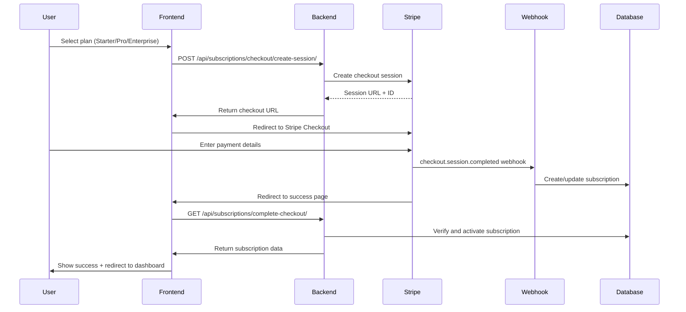
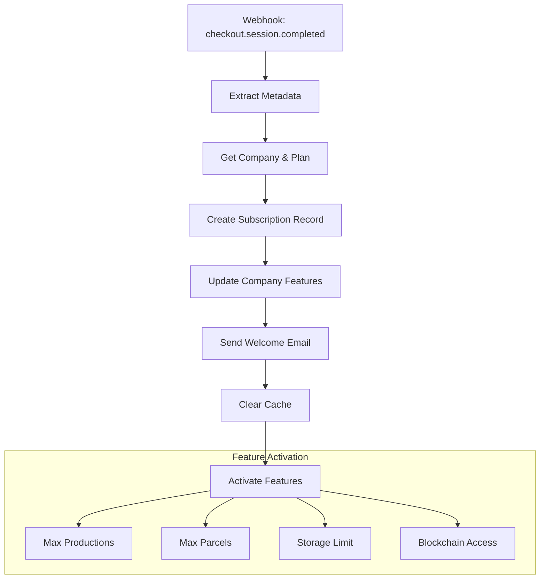
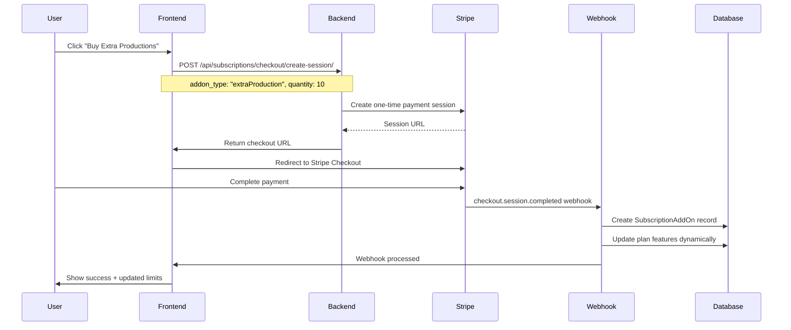
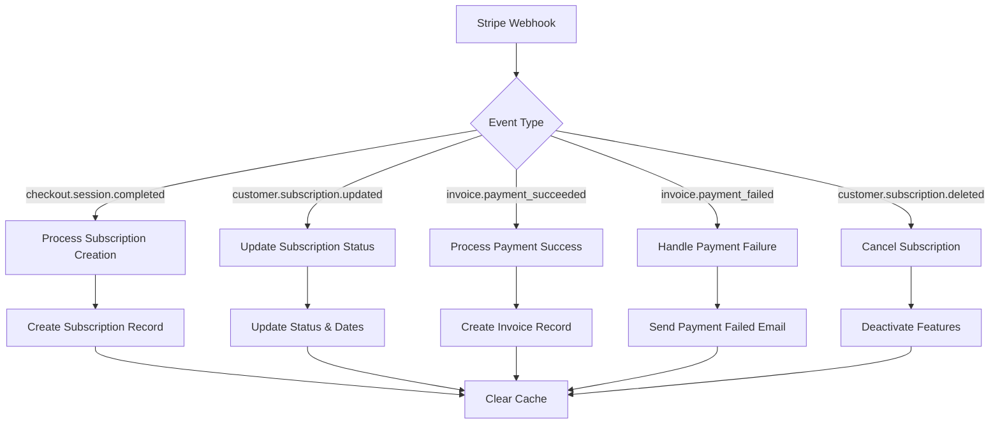

# Subscription Management Flow

## Overview and Purpose

The Subscription Management Flow handles Stripe-integrated SaaS billing with feature gating, plan management, add-on purchases, and comprehensive webhook handling. This flow ensures secure payment processing, automatic feature activation/deactivation, and seamless upgrade/downgrade experiences.

## Technical Architecture

### Backend Components
- **subscriptions/views.py**: Subscription management APIs
- **subscriptions/models.py**: Billing data models
- **subscriptions/middleware.py**: Feature gating middleware
- **subscriptions/permissions.py**: Subscription-based permissions
- **subscriptions/utils.py**: Billing utilities and email notifications

### Frontend Components
- **store/api/subscriptionApi.ts**: RTK Query subscription API
- **store/api/billingApi.ts**: Billing and payment API
- **views/Dashboard/Pricing/**: Plan selection and pricing
- **contexts/SubscriptionContext.tsx**: Subscription state management
- **utils/protections/SubscriptionRequired.tsx**: Feature gating components

### External Integrations
- **Stripe Checkout**: Payment processing
- **Stripe Customer Portal**: Self-service billing
- **Stripe Webhooks**: Real-time subscription updates
- **Email Service**: Billing notifications

## Step-by-Step Process

### 1. Plan Selection and Checkout Flow



#### Checkout Session Creation API
- **Endpoint**: `POST /api/subscriptions/checkout/create-session/`
- **Payload**:
```json
{
  "plan_id": 2,
  "company_id": 5,
  "interval": "monthly",
  "trial_days": 14,
  "new_company": false,
  "mode": "subscription"
}
```

- **Response**:
```json
{
  "sessionId": "cs_test_a1B2c3D4e5F6g7H8i9J0k1L2m3N4o5P6q7R8s9T0"
}
```

#### Stripe Checkout Session Configuration
```python
def create_checkout_session(self, request):
    """Create a new Stripe checkout session"""
    data = request.data
    plan_id = data.get('plan_id')
    company_id = data.get('company_id')
    interval = data.get('interval', 'monthly')
    trial_days = data.get('trial_days', 0)
    
    try:
        company = Company.objects.get(id=company_id)
        plan = Plan.objects.get(id=plan_id, interval=interval, is_active=True)
        
        # Create or get Stripe customer
        customer_id = self._get_or_create_stripe_customer(company, request.user)
        
        # Configure trial if applicable
        subscription_data = {}
        if trial_days > 0:
            subscription_data['trial_period_days'] = trial_days
        
        # Success/cancel URLs
        success_url = f"{settings.FRONTEND_URL}/admin/dashboard/stripe-success?success=true&session_id={{CHECKOUT_SESSION_ID}}&company_id={company.id}"
        cancel_url = f"{settings.FRONTEND_URL}/pricing?canceled=true"
        
        # Create checkout session
        checkout_session = stripe.checkout.Session.create(
            customer=customer_id,
            payment_method_types=['card'],
            line_items=[{
                'price': plan.stripe_price_id,
                'quantity': 1,
            }],
            mode='subscription',
            success_url=success_url,
            cancel_url=cancel_url,
            subscription_data=subscription_data,
            metadata={
                'company_id': company.id,
                'plan_id': plan.id,
                'interval': interval,
                'trial_days': str(trial_days)
            }
        )
        
        return Response({
            'sessionId': checkout_session['id']
        })
        
    except (Plan.DoesNotExist, Company.DoesNotExist) as e:
        return Response({'error': str(e)}, status=404)
```

### 2. Subscription Activation and Feature Gating



#### Subscription Model and Feature Management
```python
class Subscription(models.Model):
    company = OneToOneField(Company, on_delete=CASCADE)
    plan = ForeignKey(Plan, on_delete=PROTECT)
    stripe_subscription_id = CharField(max_length=255, unique=True)
    stripe_customer_id = CharField(max_length=255)
    status = CharField(max_length=50, default='active')
    current_period_start = DateTimeField()
    current_period_end = DateTimeField()
    cancel_at_period_end = BooleanField(default=False)
    trial_end = DateTimeField(null=True, blank=True)
    created_at = DateTimeField(auto_now_add=True)
    updated_at = DateTimeField(auto_now=True)
    
    @property
    def is_active(self):
        return self.status in ['active', 'trialing']
    
    @property
    def is_trial(self):
        return (self.trial_end and 
                timezone.now() < self.trial_end and 
                self.status == 'trialing')
    
    @property
    def features(self):
        """Get available features based on plan"""
        return self.plan.features
    
    def can_use_feature(self, feature_name, current_usage=0):
        """Check if feature is available within limits"""
        features = self.features
        
        if feature_name not in features:
            return False
        
        feature_limit = features[feature_name]
        
        # Handle unlimited features
        if feature_limit == -1:
            return True
        
        # Handle numeric limits
        return current_usage < feature_limit
```

#### Feature Gating Middleware
```python
class SubscriptionMiddleware:
    """Middleware to enforce subscription-based feature access"""
    
    def __init__(self, get_response):
        self.get_response = get_response
    
    def __call__(self, request):
        # Add subscription context to request
        if hasattr(request, 'user') and request.user.is_authenticated:
            company = request.user.get_active_company()
            if company and hasattr(company, 'subscription'):
                request.subscription = company.subscription
            else:
                request.subscription = None
        
        response = self.get_response(request)
        return response

class SubscriptionRequiredMixin:
    """Mixin for views that require active subscription"""
    
    def dispatch(self, request, *args, **kwargs):
        if not hasattr(request, 'subscription') or not request.subscription:
            return Response(
                {'error': 'Active subscription required'}, 
                status=403
            )
        
        if not request.subscription.is_active:
            return Response(
                {'error': 'Subscription expired or canceled'}, 
                status=403
            )
        
        return super().dispatch(request, *args, **kwargs)

class FeatureRequiredMixin:
    """Mixin for views that require specific features"""
    required_feature = None
    
    def dispatch(self, request, *args, **kwargs):
        if not self.required_feature:
            raise ValueError("required_feature must be specified")
        
        subscription = getattr(request, 'subscription', None)
        if not subscription or not subscription.can_use_feature(self.required_feature):
            return Response(
                {'error': f'Feature {self.required_feature} not available in current plan'}, 
                status=403
            )
        
        return super().dispatch(request, *args, **kwargs)
```

### 3. Add-On Purchase Flow



#### Add-On Purchase Implementation
```python
def add_addon(self, request, pk=None):
    """Add an add-on to the subscription with Stripe checkout"""
    subscription = self.get_object()
    addon_id = request.data.get('addon_id')
    quantity = int(request.data.get('quantity', 1))
    
    try:
        addon = AddOn.objects.get(id=addon_id, is_active=True)
        
        # Create checkout session for one-time payment
        checkout_session = stripe.checkout.Session.create(
            payment_method_types=['card'],
            line_items=[{
                'price': addon.stripe_price_id,
                'quantity': quantity,
            }],
            mode='payment',  # One-time payment
            customer=subscription.stripe_customer_id,
            success_url=f"{settings.FRONTEND_URL}/admin/dashboard/stripe-success?from_addon=true",
            cancel_url=f"{settings.FRONTEND_URL}/admin/dashboard/billing",
            metadata={
                'company_id': str(subscription.company.id),
                'subscription_id': str(subscription.id),
                'addon_id': str(addon.id),
                'quantity': str(quantity),
                'addon_type': addon.slug,
                'is_addon_purchase': 'true'
            }
        )
        
        return Response({
            'url': checkout_session.url,
            'session_id': checkout_session.id
        })
        
    except AddOn.DoesNotExist:
        return Response({'error': 'Add-on not found'}, status=404)
```

### 4. Webhook Processing Flow



#### Webhook Handler Implementation
```python
@csrf_exempt
def stripe_webhook(request):
    payload = request.body
    sig_header = request.META.get('HTTP_STRIPE_SIGNATURE')
    
    try:
        event = stripe.Webhook.construct_event(
            payload, sig_header, settings.STRIPE_WEBHOOK_SECRET
        )
    except (ValueError, stripe.error.SignatureVerificationError):
        return HttpResponse(status=400)
    
    # Handle different event types
    event_type = event['type']
    data = event['data']['object']
    
    if event_type == 'checkout.session.completed':
        if data.get('metadata', {}).get('is_addon_purchase') == 'true':
            handle_addon_purchase_completed(data)
        else:
            handle_checkout_session_completed(data)
            
    elif event_type == 'customer.subscription.updated':
        handle_subscription_updated(data)
        
    elif event_type == 'invoice.payment_succeeded':
        handle_invoice_payment_succeeded(data)
        
    elif event_type == 'invoice.payment_failed':
        handle_invoice_payment_failed(data)
        
    elif event_type == 'customer.subscription.deleted':
        handle_customer_subscription_deleted(data)
    
    return HttpResponse(status=200)

def handle_addon_purchase_completed(session):
    """Process completed add-on purchase"""
    try:
        metadata = session.get('metadata', {})
        company_id = metadata.get('company_id')
        addon_id = metadata.get('addon_id')
        quantity = int(metadata.get('quantity', 1))
        addon_type = metadata.get('addon_type')
        
        company = Company.objects.get(id=company_id)
        addon = AddOn.objects.get(id=addon_id)
        subscription = company.subscription
        
        with transaction.atomic():
            # Create subscription add-on record
            subscription_addon, created = SubscriptionAddOn.objects.get_or_create(
                subscription=subscription,
                addon=addon,
                defaults={'quantity': quantity}
            )
            
            if not created:
                subscription_addon.quantity += quantity
                subscription_addon.save()
            
            # Update plan features dynamically
            if addon_type == 'extraProduction':
                additional_productions = quantity * 10  # 10 productions per add-on
                custom_features = subscription.plan.features.copy()
                custom_features['max_productions_per_year'] += additional_productions
                
                # Create custom plan
                custom_plan = self._create_custom_plan(subscription, custom_features, 'productions')
                subscription.plan = custom_plan
                subscription.save()
                
            # Clear subscription cache
            cache.delete(f'subscription_features_{subscription.id}')
            
    except Exception as e:
        logger.error(f"Error processing add-on purchase: {e}")
```

## Database Models

### Core Subscription Models
```python
class Plan(models.Model):
    name = CharField(max_length=100)
    slug = SlugField(unique=True)
    description = TextField()
    price = DecimalField(max_digits=10, decimal_places=2)
    interval = CharField(max_length=20, choices=[
        ('month', 'Monthly'),
        ('year', 'Yearly')
    ])
    features = JSONField(default=dict)  # Feature limits and capabilities
    stripe_price_id = CharField(max_length=255)
    is_active = BooleanField(default=True)
    sort_order = IntegerField(default=0)
    
    class Meta:
        ordering = ['sort_order', 'price']
    
    def __str__(self):
        return f"{self.name} ({self.interval})"

class AddOn(models.Model):
    name = CharField(max_length=100)
    slug = SlugField(unique=True)
    description = TextField()
    price = DecimalField(max_digits=10, decimal_places=2)
    stripe_price_id = CharField(max_length=255)
    benefit_amount = IntegerField(help_text="Amount of benefit provided")
    benefit_type = CharField(max_length=50)  # 'productions', 'parcels', 'storage'
    is_active = BooleanField(default=True)
    
    def __str__(self):
        return self.name

class SubscriptionAddOn(models.Model):
    subscription = ForeignKey(Subscription, on_delete=CASCADE)
    addon = ForeignKey(AddOn, on_delete=CASCADE)
    quantity = IntegerField(default=1)
    purchased_at = DateTimeField(auto_now_add=True)
    
    class Meta:
        unique_together = ('subscription', 'addon')

class Invoice(models.Model):
    company = ForeignKey(Company, on_delete=CASCADE)
    subscription = ForeignKey(Subscription, on_delete=CASCADE)
    stripe_invoice_id = CharField(max_length=255, unique=True)
    amount = DecimalField(max_digits=10, decimal_places=2)
    status = CharField(max_length=50)
    invoice_date = DateTimeField()
    due_date = DateTimeField(null=True, blank=True)
    invoice_pdf = URLField(blank=True)
    description = TextField(blank=True)
    created_at = DateTimeField(auto_now_add=True)
```

### Feature Configuration Example
```python
# Plan features configuration
PLAN_FEATURES = {
    'starter': {
        'max_productions_per_year': 5,
        'max_parcels': 2,
        'max_establishments': 1,
        'storage_limit_gb': 1,
        'carbon_calculation': True,
        'qr_codes': True,
        'basic_reports': True,
        'blockchain_verification': False,
        'api_access': False,
        'priority_support': False
    },
    'professional': {
        'max_productions_per_year': 50,
        'max_parcels': 10,
        'max_establishments': 3,
        'storage_limit_gb': 10,
        'carbon_calculation': True,
        'qr_codes': True,
        'basic_reports': True,
        'advanced_reports': True,
        'blockchain_verification': True,
        'api_access': True,
        'priority_support': True,
        'usda_compliance': True
    },
    'enterprise': {
        'max_productions_per_year': -1,  # Unlimited
        'max_parcels': -1,  # Unlimited
        'max_establishments': -1,  # Unlimited
        'storage_limit_gb': 100,
        'carbon_calculation': True,
        'qr_codes': True,
        'basic_reports': True,
        'advanced_reports': True,
        'custom_reports': True,
        'blockchain_verification': True,
        'api_access': True,
        'priority_support': True,
        'dedicated_support': True,
        'usda_compliance': True,
        'white_label': True
    }
}
```

## Frontend Integration

### Subscription Context Provider
```typescript
interface SubscriptionContextType {
  subscription: Subscription | null;
  features: PlanFeatures | null;
  canUseFeature: (feature: string, currentUsage?: number) => boolean;
  isLoading: boolean;
  refetch: () => void;
}

export const SubscriptionProvider: React.FC<{ children: React.ReactNode }> = ({ children }) => {
  const { data: subscription, isLoading, refetch } = useGetSubscriptionQuery();
  
  const canUseFeature = useCallback((feature: string, currentUsage = 0) => {
    if (!subscription?.features) return false;
    
    const limit = subscription.features[feature];
    
    // Handle unlimited features
    if (limit === -1) return true;
    
    // Handle boolean features
    if (typeof limit === 'boolean') return limit;
    
    // Handle numeric limits
    return currentUsage < limit;
  }, [subscription]);
  
  const value = {
    subscription,
    features: subscription?.features || null,
    canUseFeature,
    isLoading,
    refetch
  };
  
  return (
    <SubscriptionContext.Provider value={value}>
      {children}
    </SubscriptionContext.Provider>
  );
};
```

### Feature Gating Component
```typescript
interface FeatureGateProps {
  feature: string;
  currentUsage?: number;
  fallback?: React.ReactNode;
  children: React.ReactNode;
}

export const FeatureGate: React.FC<FeatureGateProps> = ({
  feature,
  currentUsage = 0,
  fallback,
  children
}) => {
  const { canUseFeature, subscription } = useSubscription();
  
  const hasAccess = canUseFeature(feature, currentUsage);
  
  if (!hasAccess) {
    return fallback || (
      <SubscriptionLimitModal 
        feature={feature}
        currentUsage={currentUsage}
        limit={subscription?.features?.[feature]}
      />
    );
  }
  
  return <>{children}</>;
};

// Usage example
const CreateProductionButton = () => {
  const { data: productionCount } = useGetProductionCountQuery();
  
  return (
    <FeatureGate 
      feature="max_productions_per_year" 
      currentUsage={productionCount}
      fallback={<UpgradePrompt feature="productions" />}
    >
      <Button onClick={createProduction}>
        Create New Production
      </Button>
    </FeatureGate>
  );
};
```

### Subscription Limit Modal
```typescript
export const SubscriptionLimitModal: React.FC<SubscriptionLimitModalProps> = ({
  feature,
  currentUsage,
  limit,
  isOpen,
  onClose
}) => {
  const { subscription } = useSubscription();
  const [createCheckoutSession] = useCreateCheckoutSessionMutation();
  
  const getUpgradeOptions = () => {
    switch (feature) {
      case 'max_productions_per_year':
        return [
          { type: 'addon', name: 'Extra Productions (10)', price: 29 },
          { type: 'upgrade', name: 'Professional Plan', price: 99 }
        ];
      case 'blockchain_verification':
        return [
          { type: 'upgrade', name: 'Professional Plan', price: 99 }
        ];
      default:
        return [];
    }
  };
  
  const handleUpgrade = async (option: UpgradeOption) => {
    if (option.type === 'addon') {
      const result = await createCheckoutSession({
        addon_type: feature,
        quantity: 1,
        company_id: subscription?.company_id
      });
      
      if (result.data?.url) {
        window.location.href = result.data.url;
      }
    } else {
      // Handle plan upgrade
      window.location.href = '/pricing';
    }
  };
  
  return (
    <Modal isOpen={isOpen} onClose={onClose}>
      <ModalOverlay />
      <ModalContent>
        <ModalHeader>Feature Limit Reached</ModalHeader>
        <ModalCloseButton />
        
        <ModalBody>
          <VStack spacing={4} align="start">
            <Text>
              You've reached your limit of {limit} for {feature}.
              Current usage: {currentUsage}/{limit}
            </Text>
            
            <Text fontSize="sm" color="gray.600">
              Choose an option to continue:
            </Text>
            
            {getUpgradeOptions().map((option, index) => (
              <Button
                key={index}
                variant="outline"
                w="full"
                onClick={() => handleUpgrade(option)}
              >
                {option.name} - ${option.price}/month
              </Button>
            ))}
          </VStack>
        </ModalBody>
      </ModalContent>
    </Modal>
  );
};
```

## Performance Optimization

### Subscription Caching Strategy
```python
class CachedSubscriptionService:
    def get_subscription_features(self, user_id):
        """Get subscription features with caching"""
        cache_key = f'user_subscription_features_{user_id}'
        features = cache.get(cache_key)
        
        if not features:
            user = User.objects.get(id=user_id)
            company = user.get_active_company()
            
            if company and hasattr(company, 'subscription'):
                features = company.subscription.features
            else:
                features = {}  # No subscription
            
            # Cache for 1 hour
            cache.set(cache_key, features, 3600)
        
        return features
    
    def invalidate_subscription_cache(self, user_id):
        """Invalidate subscription cache when subscription changes"""
        cache_patterns = [
            f'user_subscription_features_{user_id}',
            f'subscription_status_{user_id}',
            f'plan_features_{user_id}'
        ]
        
        for pattern in cache_patterns:
            cache.delete(pattern)
```

### Database Optimization
```sql
-- Indexes for subscription queries
CREATE INDEX subscription_company_status_idx ON subscriptions_subscription(company_id, status);
CREATE INDEX subscription_stripe_id_idx ON subscriptions_subscription(stripe_subscription_id);
CREATE INDEX invoice_company_date_idx ON subscriptions_invoice(company_id, invoice_date DESC);
CREATE INDEX addon_subscription_idx ON subscriptions_subscriptionaddon(subscription_id, addon_id);

-- Partial index for active subscriptions
CREATE INDEX active_subscription_idx ON subscriptions_subscription(company_id) 
WHERE status IN ('active', 'trialing');
```

## Security Considerations

### Webhook Security
```python
def verify_stripe_webhook(request):
    """Verify Stripe webhook signature"""
    payload = request.body
    sig_header = request.META.get('HTTP_STRIPE_SIGNATURE')
    endpoint_secret = settings.STRIPE_WEBHOOK_SECRET
    
    try:
        event = stripe.Webhook.construct_event(
            payload, sig_header, endpoint_secret
        )
        return event
    except ValueError:
        # Invalid payload
        logger.error("Invalid webhook payload")
        raise ValueError("Invalid payload")
    except stripe.error.SignatureVerificationError:
        # Invalid signature
        logger.error("Invalid webhook signature")
        raise stripe.error.SignatureVerificationError("Invalid signature")
```

### Payment Security
```python
class SecureCheckoutService:
    def create_secure_session(self, user, plan, company):
        """Create secure checkout session with validation"""
        
        # Validate user permissions
        if not user.can_manage_company(company):
            raise PermissionDenied("User cannot manage this company")
        
        # Validate plan availability
        if not plan.is_active:
            raise ValidationError("Plan is not available")
        
        # Check for existing subscription
        if hasattr(company, 'subscription') and company.subscription.is_active:
            raise ValidationError("Company already has active subscription")
        
        # Create session with security metadata
        session = stripe.checkout.Session.create(
            # ... session configuration ...
            metadata={
                'user_id': user.id,
                'company_id': company.id,
                'plan_id': plan.id,
                'security_hash': self._generate_security_hash(user, company, plan)
            }
        )
        
        return session
```

## Testing Strategy

### Subscription Flow Tests
```python
class SubscriptionFlowTest(TestCase):
    def setUp(self):
        self.user = self.create_test_user()
        self.company = self.create_test_company()
        self.plan = self.create_test_plan()
    
    def test_subscription_creation_flow(self):
        """Test complete subscription creation flow"""
        # Create checkout session
        response = self.client.post('/api/subscriptions/checkout/create-session/', {
            'plan_id': self.plan.id,
            'company_id': self.company.id,
            'interval': 'monthly'
        })
        
        self.assertEqual(response.status_code, 200)
        self.assertIn('sessionId', response.json())
        
        # Simulate webhook
        self.simulate_stripe_webhook('checkout.session.completed', {
            'metadata': {
                'company_id': self.company.id,
                'plan_id': self.plan.id
            }
        })
        
        # Verify subscription created
        subscription = Subscription.objects.get(company=self.company)
        self.assertEqual(subscription.plan, self.plan)
        self.assertEqual(subscription.status, 'active')
    
    def test_feature_gating(self):
        """Test feature gating based on subscription"""
        # Test without subscription
        response = self.client.post('/api/premium-feature/')
        self.assertEqual(response.status_code, 403)
        
        # Create subscription
        subscription = self.create_test_subscription(self.company, self.plan)
        
        # Test with subscription
        response = self.client.post('/api/premium-feature/')
        self.assertEqual(response.status_code, 200)
```

### Webhook Testing
```python
class WebhookTest(TestCase):
    def test_webhook_signature_validation(self):
        """Test webhook signature validation"""
        payload = json.dumps({'type': 'test'})
        signature = self.generate_webhook_signature(payload)
        
        response = self.client.post(
            '/api/subscriptions/webhook/',
            data=payload,
            content_type='application/json',
            HTTP_STRIPE_SIGNATURE=signature
        )
        
        self.assertEqual(response.status_code, 200)
    
    def test_subscription_update_webhook(self):
        """Test subscription update webhook handling"""
        subscription = self.create_test_subscription()
        
        webhook_data = {
            'type': 'customer.subscription.updated',
            'data': {
                'object': {
                    'id': subscription.stripe_subscription_id,
                    'status': 'past_due',
                    'current_period_end': int(time.time()) + 86400
                }
            }
        }
        
        self.process_webhook(webhook_data)
        
        subscription.refresh_from_db()
        self.assertEqual(subscription.status, 'past_due')
```

---

*Last Updated: 2025-06-27*
*Flow Version: 1.0*